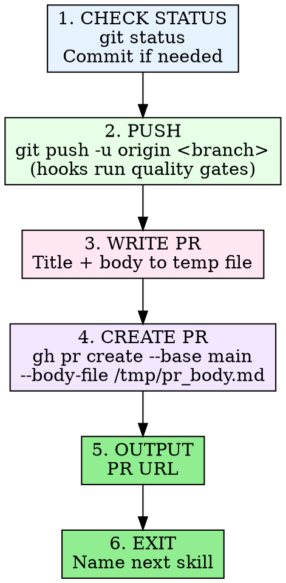

# Create PR

Commit, push, and open a pull request. Quality gates (gdlint, gdformat,
cross-file ID uniqueness, stale-count scan, scene reference validation)
are enforced automatically by husky pre-commit and pre-push hooks —
no manual test/lint step needed.

## Invocation

```
/create-pr
```

## Process



### 1. Check Git Status

```bash
git status
```

If there are uncommitted changes, stage and commit them:

```bash
git add <specific-files>
cat > /tmp/commit-msg.txt << 'EOF'
type(scope): description

Co-Authored-By: Claude Opus 4.6 (1M context) <noreply@anthropic.com>
EOF
git commit -s -F /tmp/commit-msg.txt
```

The pre-commit hook runs **gdlint** and **gdformat** automatically.
If the commit fails, fix the reported issues and retry — do not
use `--no-verify`.

### 2. Push

```bash
git push -u origin "$(git branch --show-current)"
```

The pre-push hook runs **cross-file ID uniqueness**, **stale-count
scan**, and **scene reference validation**. If the push fails, fix
the reported issues and retry.

### 3. Write PR Body

Write title and body to `/tmp/pr_body.md`. **Never use heredoc with
`gh pr create --body`** — special characters break shell escaping.

PR body format:

```markdown
## Summary
- Bullet points describing what changed and why

## Test plan
- [x] Pre-commit hooks pass (gdlint, gdformat)
- [x] Pre-push quality gates pass (ID uniqueness, stale counts, scene refs)
- [ ] Manual verification steps if applicable

Generated with [Claude Code](https://claude.ai/code)
```

### 4. Create PR

```bash
gh pr create --base main \
  --title "type(scope): short description" \
  --body-file /tmp/pr_body.md
```

Title should be under 70 characters, following commit conventions:
`feat`, `fix`, `docs`, `refactor`, `test`, `chore`.

### 5. Output the PR URL

Print the URL returned by `gh pr create` so the user can open it.

### 6. Exit with Handoff

After outputting the PR URL, always end with:

> "PR #{number} created: {url}. Next step: run
> `/pr-review-response {number}` to detect the PR type, run automated
> review, and address any feedback."

## Iron Rules

- **Hooks are the quality gates.** Do not run separate test/lint
  commands — the husky pre-commit (gdlint + gdformat) and pre-push
  (ID uniqueness, stale counts, scene refs) hooks handle it.
- **Never bypass hooks.** Do not use `--no-verify`. If a hook fails,
  fix the issue.
- **Temp file for body.** Always write to `/tmp/pr_body.md` and use
  `--body-file`. Never `--body` with inline text.
- **Target main.** Always `--base main` unless explicitly told otherwise.
- **Specific git add.** Stage files by name, not `git add -A` or
  `git add .`.
- **Sign-off on commits.** Always use `-s` flag (DCO required).
- **Explicit handoff.** Always name `/pr-review-response` as the next
  step in the exit message.
