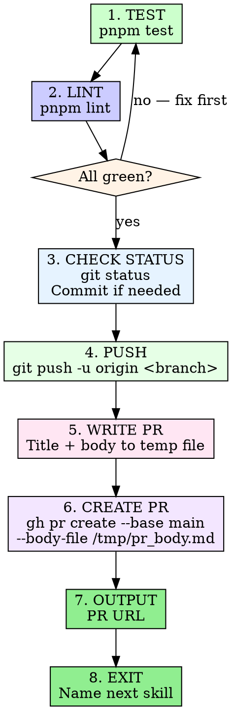

# Create PR

Verify, commit, push, and open a pull request — in that order.

## Invocation

```
/create-pr
```

## Process



### 1. Run Tests

```bash
pnpm test
```

Must pass. If tests fail, fix the issue before proceeding.

### 2. Run Lint

```bash
pnpm lint
```

Must pass. If lint fails, fix type errors before proceeding.

### 3. Check Git Status

```bash
git status
```

If there are uncommitted changes, stage and commit them:

```bash
git add <specific-files>
cat > /tmp/commit-msg.txt << 'EOF'
type(scope): description

Co-Authored-By: Claude Opus 4.6 (1M context) <noreply@anthropic.com>
EOF
git commit -F /tmp/commit-msg.txt
```

### 4. Push

```bash
git push -u origin "$(git branch --show-current)"
```

### 5. Write PR Body

Write title and body to `/tmp/pr_body.md`. **Never use heredoc with
`gh pr create --body`** — special characters break shell escaping.

PR body format:

```markdown
## Summary
- Bullet points describing what changed and why

## Test plan
- [x] Tests pass
- [x] Lint passes
- [ ] Manual verification steps if applicable

Generated with [Claude Code](https://claude.ai/code)
```

### 6. Create PR

```bash
gh pr create --base main \
  --title "type(scope): short description" \
  --body-file /tmp/pr_body.md
```

Title should be under 70 characters, following commit conventions:
`feat`, `fix`, `docs`, `refactor`, `test`, `chore`.

### 7. Output the PR URL

Print the URL returned by `gh pr create` so the user can open it.

### 8. Exit with Handoff

After outputting the PR URL, always end with:

> "PR #{number} created: {url}. Next step: run
> `/pr-review-response {number}` to detect the PR type, run automated
> review, and address any feedback."

## Iron Rules

- **Tests before PR.** Never create a PR with failing tests or lint.
- **Temp file for body.** Always write to `/tmp/pr_body.md` and use
  `--body-file`. Never `--body` with inline text.
- **Target main.** Always `--base main` unless explicitly told otherwise.
- **Specific git add.** Stage files by name, not `git add -A` or
  `git add .`.
- **Explicit handoff.** Always name `/pr-review-response` as the next
  step in the exit message.
