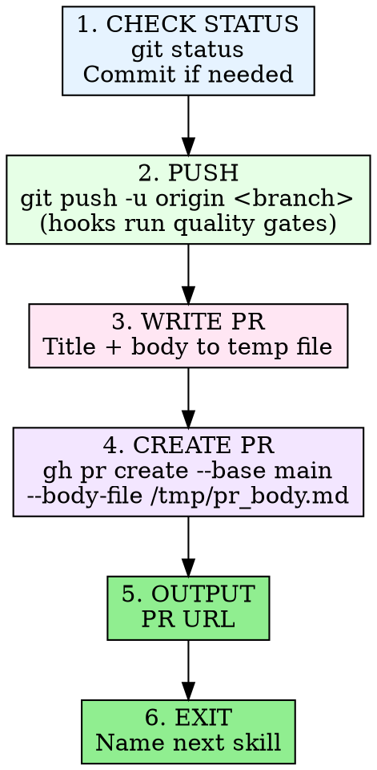

# Create PR

Commit, push, and open a pull request. Quality gates are enforced
automatically by husky hooks — no manual test/lint step needed:

- **pre-commit:** branch protection (no direct commits to main) +
  gdlint + JSON validation + `gdformat --check`.
- **pre-push:** quality-gate self-tests + cross-file ID-uniqueness
  scan + stale-count scan + scene-ref scan + doc-citation integrity +
  dialogue sync + American-English spelling + Godot import
  (`godot --headless --path game/ --import`) + the full GUT test suite
  + Gate L (Run Summary present, nothing failed, every collected test
  passed, script/test counts at or above `gut-baseline.txt`).
  **No Godot installed is a failure, not a skip** — the hook exits
  non-zero rather than reporting success on a tree whose suite never
  ran.

## Invocation

```
/create-pr
```

## Process


```dot
digraph create_pr {
    rankdir=TB;
    node [shape=box, style=filled, fillcolor=lightblue];

    status [label="1. CHECK STATUS\ngit status\nCommit if needed", fillcolor="#e6f3ff"];
    push [label="2. PUSH\ngit push -u origin <branch>\n(hooks run quality gates)", fillcolor="#e6ffe6"];
    write [label="3. WRITE PR\nTitle + body to temp file", fillcolor="#ffe6f3"];
    create [label="4. CREATE PR\ngh pr create --base main\n--body-file /tmp/pr_body.md", fillcolor="#f3e6ff"];
    url [label="5. OUTPUT\nPR URL", fillcolor=lightgreen];
    handoff [label="6. EXIT\nName next skill", fillcolor=lightgreen];

    status -> push;
    push -> write;
    write -> create;
    create -> url;
    url -> handoff;
}
```

### 1. Check Git Status

```bash
git status
```

If there are uncommitted changes, stage and commit them:

```bash
git add <specific-files>
cat > /tmp/commit-msg.txt << 'EOF'
type(scope): description

Co-Authored-By: Claude Opus 4.8 (1M context) <noreply@anthropic.com>
EOF
git commit -s -F /tmp/commit-msg.txt
```

The pre-commit hook runs **branch protection**, **gdlint**, **JSON
validation**, and **`gdformat --check`** automatically. If the commit
fails, fix the reported issues and retry — do not use `--no-verify`.

### 2. Push

```bash
git push -u origin "$(git branch --show-current)"
```

The pre-push hook runs the **quality-gate self-tests**, **cross-file
ID uniqueness**, **stale-count scan**, **scene reference
validation**, **doc-citation integrity**, **dialogue sync**,
**American-English spelling**, **Godot import**
(`godot --headless --path game/ --import`), the **full GUT test
suite**, and **Gate L** over the run's log. If the push fails, fix
the reported issues and retry.

Two failures look like infrastructure but are not. `Godot NOT FOUND`
means the hook refused to pass a tree it could not test — install
Godot or set `GODOT_BIN`, never work around it. `GODOT LOCK TIMEOUT`
means another worktree is running headless Godot; wait for it, because
a second concurrent run collects fewer test scripts and Gate L reports
that as a silently-skipped test file.

### 3. Write PR Body

Write title and body to `/tmp/pr_body.md`. **Never use heredoc with
`gh pr create --body`** — special characters break shell escaping.

PR body format:

```markdown
## Summary
- Bullet points describing what changed and why

## Test plan
- [x] Pre-commit gates pass (branch protection, gdlint, JSON validation, gdformat --check)
- [x] Pre-push gates pass (ID uniqueness, stale counts, scene refs, Godot import, full GUT suite, Gate L count floor)
- [ ] Manual verification steps if applicable

Generated with [Claude Code](https://claude.ai/code)
```

### 4. Create PR

```bash
gh pr create --base main \
  --title "type(scope): short description" \
  --body-file /tmp/pr_body.md
```

Title should be under 70 characters, following commit conventions:
`feat`, `fix`, `docs`, `refactor`, `test`, `chore`.

### 5. Output the PR URL

Print the URL returned by `gh pr create` so the user can open it.

### 6. Exit with Handoff

After outputting the PR URL, always end with:

> "PR #{number} created: {url}. Next step: run
> `/pr-review-response {number}` to detect the PR type, run automated
> review, and address any feedback."

## Iron Rules

- **Hooks are the quality gates.** Do not run separate test/lint
  commands — the husky pre-commit (branch protection, gdlint, JSON
  validation, gdformat --check) and pre-push (ID uniqueness, stale
  counts, scene refs, Godot import, full GUT suite, GUT count floor)
  hooks handle it. The one exception is `bash scripts/gates.sh`, on
  work the hooks cannot see: uncommitted state in a parallel worktree
  (pre-commit sees only the index), or a stacked branch that must be
  judged against its own parent rather than `main`
  (`GATES_BASE=<parent> bash scripts/gates.sh`). It shares the
  headless-Godot mutex with pre-push, so a hand-run and a push cannot
  start two Godots between them — which matters because a contended
  run collects fewer test scripts and Gate L reads that as a
  silently-skipped test file. That is the whole
  carve-out — it is not general permission to run tests by hand, it
  does not replace either hook, and both hooks still run on every
  commit and push. See AGENTS.md § Essential Commands.
- **Never bypass hooks.** Do not use `--no-verify`. If a hook fails,
  fix the issue.
- **Temp file for body.** Always write to `/tmp/pr_body.md` and use
  `--body-file`. Never `--body` with inline text.
- **Target main.** Always `--base main` unless explicitly told otherwise.
- **Specific git add.** Stage files by name, not `git add -A` or
  `git add .`.
- **Sign-off on commits.** Always use `-s` flag (DCO required).
- **Explicit handoff.** Always name `/pr-review-response` as the next
  step in the exit message.
