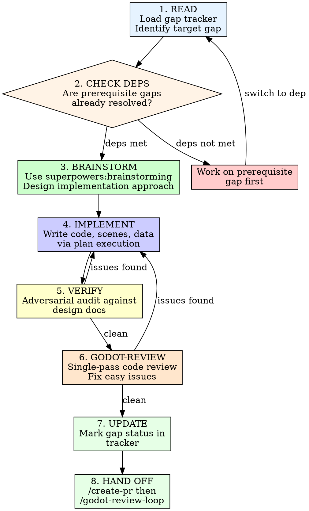

# Game Designer

Build the Pendulum of Despair Godot game one implementation gap at a
time. Each invocation picks a gap from the development tracker,
implements it in `game/`, verifies it against the canonical design
docs in `docs/story/`, and updates the gap tracker.

## Invocation

```
/game-designer                    # Show current gaps, recommend next
/game-designer <gap-id>           # Work on specific gap (e.g., "1.1")
/game-designer audit              # Re-audit all gaps against current game/ state
```

## Reference Documents

**Gap tracker:** `docs/analysis/game-dev-gaps.md`
**Design docs:** `docs/story/` (49K+ lines across 57 files — the canonical source of truth)
**Architecture:** `docs/plans/technical-architecture.md`

The gap tracker is the single source of truth for what's been built and
what remains. Read it on every invocation. Update it after every
completed gap.

## Core Principle: Design Docs Are Law

**Every value, formula, and behavior must trace back to a canonical
design document in `docs/story/`.**

This game has 49,000+ lines of mechanical game design built over weeks
of careful work. The game-designer skill does not:
- Invent mechanics not in the design docs
- Improvise numeric values (stats, prices, damage, rates)
- "Improve" formulas beyond what's specified
- Add features not documented in the design docs
- Approximate when exact values are available

If a design doc says physical damage is `ATK² / 6 - DEF`, the code
implements the mathematically equivalent `atk * atk / 6 - def` (not
an approximation, not a "simplified" version). If `economy.md` says
Potion costs 50g, the JSON says `"buy_price": 50`. No rounding, no
"close enough."

When a design doc is ambiguous or has a gap, **stop and ask the user**
rather than making assumptions. Use the `story-designer` skill to fill
design gaps before implementing them.

## Process



### 1. Read Gap Tracker

Load `docs/analysis/game-dev-gaps.md`. Parse:
- Current status of each gap
- Dependencies between gaps
- What's needed (checklist items)

If invoked without arguments, display a summary table and recommend
the highest-priority unblocked gap.

If invoked with `audit`, re-read the `game/` directory tree and verify
every gap status is accurate. Update any that have drifted.

### 2. Check Dependencies

Before implementing a gap, verify its prerequisites are resolved:
- Read the "Depends On" field
- Check the dependency's status in the gap tracker
- If the dependency is not MOSTLY COMPLETE or COMPLETE, warn the user
  and suggest working on the dependency first

Dependencies can be overridden if the user explicitly chooses to work
on a gap with unresolved deps.

### 3. Brainstorm the Implementation

Use the `superpowers:brainstorming` skill to design the approach:
- Present the gap context (what exists, what's needed, what it blocks)
- Identify which design docs govern this gap
- Read the relevant design doc sections in full
- Propose 2-3 implementation approaches with tradeoffs
- Get user approval on approach
- Write the spec to `docs/superpowers/specs/`

**Implementation-specific questions to always consider:**
- What's the minimal testable output? (Can we see something in Godot?)
- What placeholder assets are needed? (Colored rectangles, silence .ogg)
- Does this touch existing autoload singletons? (Careful — they have defensive coding from PR #105 review)
- What data does this system load, and is that data JSON created yet?
- How does this integrate with GameManager state machine?

### 4. Implement

Use `superpowers:writing-plans` to create the implementation plan, then
execute it. Output goes into `game/` following `technical-architecture.md`
directory structure.

**File placement rules:**
- GDScript: `game/scripts/{category}/{name}.gd`
- Scenes: `game/scenes/{category}/{name}.tscn`
- JSON data: `game/data/{category}/{name}.json`
- Placeholder art: `game/assets/{category}/{name}.png`
- Placeholder audio: `game/assets/{category}/{name}.ogg`

**Coding standards (from godot-review checklists):**
- Static typing on all parameters, returns, and variables
- No `class_name` on autoload scripts
- `ResourceLoader.exists()` before `load()`
- Error returns checked (not just scene transitions)
- State/signal emission after validation, not before
- Docstrings accurately reflect current behavior (mark stubs as stubs)
- `print()` gated behind `OS.is_debug_build()`
- No `null` where typed default works
- GDScript falsy checks use explicit `!= null` for null detection

**Every fix is new code — review it.** Before committing any change,
mentally walk through: what calls this, what reads this state, what
happens if this is deferred/async. (Learned the hard way in PR #105
Round 5.)

**Dual-pass self-review before commit (MANDATORY):**
Before committing ANY .gd file, do BOTH passes on every public method:

*Mechanical pass:* What if called before initialize()? What if input is
empty/negative/null? What if called twice? Does every if-branch have a
test? Does every signal emission have a watching test?

*Narrative pass:* Does this match the design doc? Is the signal flow
correct? Does the spec match what I just wrote?

*Mirror check:* `grep -r "old_value" docs/` after every change. Fix
every stale reference immediately — don't defer.

*GDScript runtime safety pass (MANDATORY for any _input/_unhandled_input handler):*
- Does any action in this handler trigger a scene swap (`change_core_state`,
  `change_scene_to_file`, `pop_overlay`)? If yes, that call MUST be the
  LAST line — no `get_viewport()`, no member access, no signal emission after it.
- `get_viewport()` returns null after scene swap is queued. NEVER call
  `get_viewport().set_input_as_handled()` after a scene transition.
- Static review CANNOT catch these bugs. Ask the user to press F5 and test
  every input handler on every screen before declaring done.

*Behavioral state trace (MANDATORY — the pass Copilot does that I keep skipping):*
For EVERY entity, signal, and state machine in the code, ask these questions
and write down the answers. Do NOT skip this. Do NOT say "I should do this"
and then not do it. Actually trace each path:

1. **Repeatability:** Can this action happen more than once? If yes, does the
   code allow it? (PR #120: TriggerZone is one-shot but doors must be
   repeatable. Used wrong entity type.)
2. **Ownership:** Who owns this input/action? Is there exactly ONE handler?
   (PR #120: Both player_character and exploration handled ui_accept —
   double-fire.)
3. **Initialization:** Every entity that needs initialize() — is it actually
   called? With the right arguments? (PR #120: metadata set on .tscn but
   initialize() never called. Entities silently did nothing.)
4. **Dimensions:** Do pixel sizes match the viewport? (PR #120: 176px
   background in 180px viewport — 4px gap.)
5. **State cleanup:** Do tests reset ALL global state they depend on?
   (PR #120: EventFlags not cleared, tests leaked state.)
6. **Spec accuracy:** Does the spec describe what was ACTUALLY built, not
   what was PLANNED? (PR #120: spec said TileMapLayer, code used ColorRect.)
7. **Return path:** After any state change (overlay push, map load, scene
   swap), can the user get back? What happens when they do? (PR #119: menu
   overlap when returning from rest sub-state.)

For each question, write the entity/file/line and the answer. If you can't
answer "yes it works" with a specific code reference, it's a bug.

### 5. Verify (Adversarial Audit Against Design Docs)

After implementation, verify every output against canonical docs.
This is NOT optional.

**Numeric verification:**
- Every stat value in JSON matches the exact number in the design doc
- Every formula in GDScript matches the exact formula in combat-formulas.md
- Every price matches economy.md
- Every damage/HP/MP value matches the relevant source doc
- Run spot-checks: does the damage formula produce 2-4 hit kills on
  Act I enemies per difficulty-balance.md?

**Cross-reference verification:**
- Every enemy_id in encounter tables exists in the enemy data JSON
- Every item_id in shop inventories exists in the item data JSON
- Every spell_id in character learn schedules exists in spell data JSON
- Every flag name in dialogue conditions exists in events.md
- Every character_id matches characters.md

**Architecture verification:**
- Scene tree structure matches technical-architecture.md Section 4
- Autoload usage follows the "data via DataManager, audio via
  AudioManager" pattern
- State transitions go through GameManager (no direct change_scene_to_file)
- Signals follow "call down, signal up" architecture

**Behavioral verification (when testable):**
- Open the scene in Godot editor — does it load cleanly?
- If runnable, does the behavior match the design doc description?
- Are placeholder assets visible and correctly sized?

### 6. Godot Review (Pre-PR Cleanup)

Run `/godot-review` (single pass, no PR number) on the local changes
before creating a PR. This catches GDScript quality issues, naming
violations, and checklist items from the defensive coding checklist at
`.claude/skills/godot-review/references/verification-checklists.md`.

Fix any issues found. If the review triggers code changes, re-run
Step 5 verification on the changed files.

### 7. Update Gap Tracker

After verification and review pass:
1. Update the gap's status in `docs/analysis/game-dev-gaps.md`
2. Check off completed items in the "What's Needed" list
3. Add a row to the Progress Tracking table
4. Check if this completion unblocks any downstream gaps
5. If downstream gaps are now unblocked, note this for the user

### 8. Hand Off

Every session ends by naming the next steps:

```
1. /create-pr — open a PR targeting main
2. /godot-review-loop <PR#> 2 — multi-round hardening on the PR
3. Address Copilot comments + gap analysis (autonomous — no reminder needed)
```

Follow the standard commit workflow:
```bash
git add game/ docs/analysis/game-dev-gaps.md docs/superpowers/specs/
git commit -F /tmp/commit-msg.txt
git push
```

## Audit Mode

When invoked with `/game-designer audit`:

1. Read the `game/` directory tree (scripts, scenes, data, assets)
2. For each gap in the tracker, verify:
   - Do the referenced output files exist?
   - Does the content match the claimed status?
   - Are checklist items actually completed?
   - Has anything been added outside this skill that changes a gap?
3. Cross-reference JSON data against design docs:
   - Are all enemies from bestiary/ represented in enemy JSON?
   - Are all items from items.md represented in item JSON?
   - Are all shop inventories from economy.md represented in shop JSON?
4. Update all statuses
5. Report changes:
   - Upgrades (gap was more complete than status claimed)
   - Downgrades (gap was less complete than status claimed)
   - New gaps discovered (systems not in the original analysis)
6. Commit the updated tracker

## Design Session Flow

A typical session looks like:

```
User: /game-designer
Claude: [Shows gap table, recommends "1.1 Character Data" as next target]

User: /game-designer 1.1
Claude: [Checks deps: none. Starts brainstorming.]
Claude: "For character data, I'll read progression.md and characters.md
         to build the 6 character JSON files. The schema is defined in
         technical-architecture.md Section 2.10. Two approaches:
         A) Manual transcription with verification pass
         B) Automated extraction script + manual review
         I recommend A — the data is small (6 files) and manual ensures
         every value is eyeballed against the source."
User: [Approves approach A]
Claude: [Writes spec, creates plan, implements JSON files]
Claude: [Runs adversarial verification against progression.md tables]
Claude: [Runs /godot-review on local changes]
Claude: [Updates game-dev-gaps.md: 1.1 -> COMPLETE]
Claude: "Character data complete. 6 JSON files verified against
         progression.md. This unblocks: 2.1 (PlayerCharacter Prefab),
         3.3 (Battle Scene), 3.4 (Menu Overlay).

         Next steps:
         1. /create-pr to open a PR targeting main
         2. /godot-review-loop <PR#> 2 for hardening

         Recommend 1.2 (Enemy Data) next — unblocks battle system."
```

## Rules

- **One gap per session.** Deep focus on one implementation chunk at a time.
- **Always brainstorm first.** Even "obvious" data transcription needs user input on approach.
- **Design docs are law.** No inventing values. No improvising mechanics. Every number traces to a source doc.
- **Verify adversarially.** Assume your own output has errors. Check every value.
- **Update the tracker.** Every session ends with an updated gap doc.
- **Cross-reference everything.** JSON IDs must match across files. Flag names must match events.md.
- **Placeholder assets are fine.** Colored rectangles for sprites, silence for audio. Art/audio are separate gaps (4.8, 4.9).
- **Don't over-engineer.** Implement what the design doc specifies, nothing more. YAGNI applies.
- **Review before PR.** Run godot-review locally. Fix issues. Then create the PR.
- **Every fix is new code.** Trace execution flow before committing. (Memory: fix-is-new-code-review-it)
- **Exit with handoff.** Every session ends by naming the next skill: `/create-pr` → `/godot-review-loop`.
- **Gap analysis is autonomous.** When Copilot comments on the PR, run gap analysis without being asked. (Memory: gap-analysis-self-discipline)
