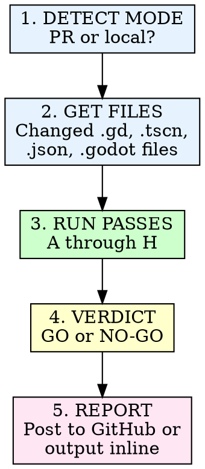

# Godot Code Review

Single-pass review of Godot project changes for the Pendulum of Despair
JRPG. Checks GDScript quality, scene architecture, pixel art rendering,
data integrity, and design doc compliance.

## Invocation

```
/godot-review              # Review local uncommitted/staged changes
/godot-review <PR#>        # Review PR and post to GitHub
```

## Mode Detection

**PR mode:** Fetch changed files from GitHub, run all passes, post
review comment to the PR.

**Local mode:** Diff staged/uncommitted changes against HEAD, run all
passes, output inline.

## Process



## Review Passes

### Pass A: GDScript Type Safety & Style

Check all changed `.gd` files for:
- Static typing on all parameters, return types, and variables
- GDScript style guide compliance (naming, script member ordering)
- No common antipatterns (get_parent, uncached node lookups, null misuse)
- Script files under 300 lines (suggest splitting if over)

### Pass B: Signal Architecture & Scene Composition

Check `.gd` and `.tscn` files for:
- "Call down, signal up" principle respected
- No child-to-parent references
- Scenes have single clear responsibility
- Correct node types for purpose
- `process_mode` set correctly on overlay scenes

### Pass C: Pixel Art Rendering

Check project settings and scene files for:
- Viewport 1280x720 with 4x camera zoom (effective 320x180), integer scaling
- Nearest-neighbor texture filter everywhere
- Snap-to-pixel enabled (transforms and vertices)
- No sub-pixel positions in scene files
- No fractional camera zoom
- Sprite sizes match technical-architecture.md (16x24 character, 16x16 tile)

### Pass D: Data Integrity

Check `.json` data files for:
- snake_case keys throughout
- Values match canonical source docs (bestiary, items.md, equipment.md, etc.)
- Correct file location per technical-architecture.md directory structure
- Valid JSON syntax (no trailing commas, proper nesting)
- Save schema has all 9 required groups if save-related

### Pass E: State Machine & Autoload Compliance

Check game logic for:
- Core state transitions go through `GameManager.change_core_state()`
- Overlay pushes use `push_overlay()` and check return value
- Data loaded via `DataManager`, not direct file I/O
- Audio played via `AudioManager`, not standalone players
- Flags via `EventFlags`, not custom dictionaries

### Pass F: Audio Integration

Check audio-related code and data for:
- Channel budget compliance (24 total)
- Priority stack respected
- Mixing model matches context (overworld/dungeon/battle/pallor)
- SFX IDs match audio.md catalog
- Asset format: OGG Vorbis, 44.1kHz, 16-bit

### Pass G: Performance

Check for performance antipatterns:
- No `load()` or uncached lookups in `_process()`
- Entity/emitter counts within budget
- Unnecessary `_process()` on idle nodes
- String concatenation in hot loops
- Tilemap layer count within budget

### Pass H: Design Doc Compliance

Cross-reference implementation against game design docs:
- Combat mechanics match combat-formulas.md
- UI layout matches ui-design.md
- Save behavior matches save-system.md
- Accessibility features match accessibility.md
- Numeric values match bestiary/items/equipment canonical sources

## Verdict Categories

**BLOCKER:** Crashes, data loss, broken pixel rendering, state machine
violations. Must fix before merge.

**ISSUE:** Design doc mismatch, type safety gap, style violation,
incorrect audio behavior. Should fix before merge.

**SUGGESTION:** Performance optimization, code organization improvement,
naming preference. Fix if trivial.

## Report Format

```markdown
## Godot Review: [GO|NO-GO]

**Files reviewed:** N .gd, N .tscn, N .json
**Issues found:** N BLOCKER, N ISSUE, N SUGGESTION

### Pass A: GDScript Type Safety & Style
- [ISSUE] file.gd:42 — Missing return type on `func calculate_damage()`
- [SUGGESTION] file.gd:180 — Script is 285 lines, approaching split threshold

### Pass B: Signal Architecture
(clean)

...
```

## Dual-Pass Review (MANDATORY)

Every review MUST include BOTH a mechanical pass and a narrative pass.
This is non-negotiable. Narrative-only review consistently misses what
Copilot catches (PRs #114-117 proved this).

**Mechanical pass** — for every public method in every changed .gd file:
1. What if called before `initialize()`? (guard empty ID/data)
2. What if input is empty, negative, null? (validate + push_error)
3. What if called twice? (guard double-fire/double-open)
4. Does every `if` branch have a test?
5. Does every signal emission have a watching test?
6. After code changes: grep docs for stale mirrors

**Narrative pass** — for every changed file:
1. Does the entity do what the design doc says?
2. Signal flow: "call down, signal up" respected?
3. Scene tree matches tech-arch?
4. Collision layers correct?
5. Spec matches implementation?

## Rules

- **Read the verification checklists.** Before running passes, read
  `.claude/skills/godot-review/references/verification-checklists.md`.
- **Dual-pass mandatory.** Both mechanical AND narrative. No exceptions.
- **Check every changed file.** Don't skip `.json` data or `.tscn` scene files.
- **Cross-reference design docs.** Every numeric value should trace back
  to a canonical source in `docs/story/`.
- **Be specific.** Report file:line for every finding.
- **No false positives.** If you're unsure, read the source doc before flagging.
- **File issues for skipped findings.** Every finding marked SKIP,
  out-of-scope, or cosmetic MUST be captured as a `bd create` issue
  before the review is considered complete. Reviews that identify
  problems but don't file them are incomplete — the findings will be
  forgotten. Include the PR number in the issue description.
