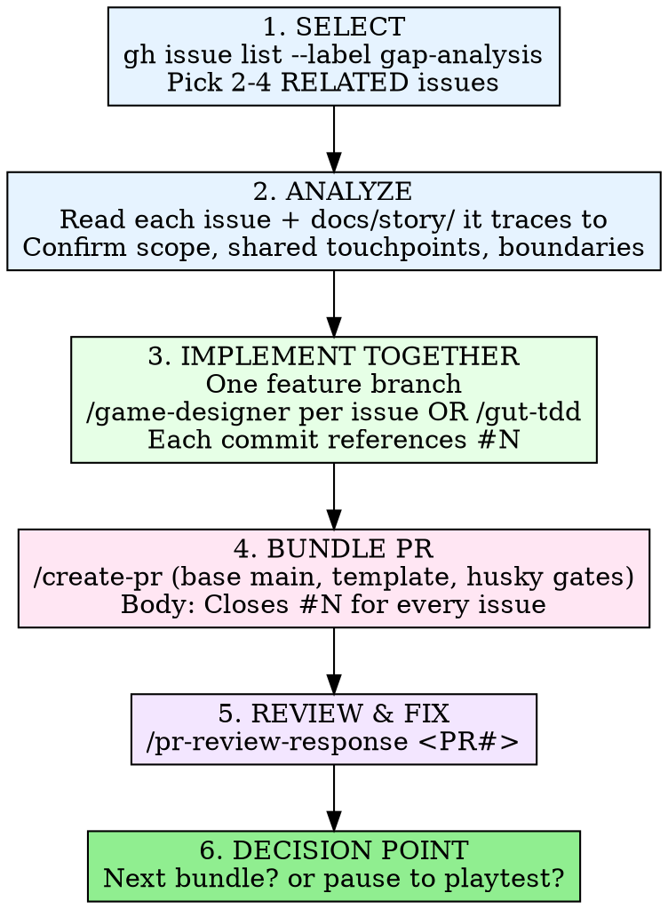

# Issue Bundle

Drive the project's core loop end to end: **GitHub Issues → analyze a
few related issues → implement them together → bundle into ONE PR →
review & fix the PR.**

Bundling beats one-issue-at-a-time when issues share code. Implementing
GAP-008 and GAP-010 separately means touching `damage_calculator.gd`
twice, two PRs, two review loops, two sets of husky gate runs — and the
second PR rebases onto the first. Bundling related issues amortizes all
of that into one coherent change.

## Invocation

```
/issue-bundle                 # Show open gap-analysis issues, propose a bundle
/issue-bundle <#N> <#M> ...   # Bundle these specific issues
```

## Reference Documents

- **Relatedness heuristics + example bundle map:** `references/bundling-guide.md`
- **Issue tracker:** GitHub Issues labeled `gap-analysis`
  (`gh issue list --label gap-analysis`), with per-gap detail in
  `docs/issues/GAP-*.md`.
- **Design docs (law):** `docs/story/` — every value/formula/behavior
  must trace back here.
- **Gap tracker doc:** `docs/analysis/game-design-gaps.md` (read-only history).

## The Loop



---

## Step 1 — SELECT a coherent bundle

List open work and pick a **small set of 2-4 RELATED issues**. Related
means they share a real code touchpoint — not just "both are combat."

```bash
gh issue list --label gap-analysis --state open
gh issue view <N>            # read the issue body
```

Spot relatedness by looking for any of these (full heuristics in
`references/bundling-guide.md`):

- **Same module / file** — both edit `game/scripts/combat/battle_actions.gd`.
- **Same function signature** — both pass params into
  `damage_calculator.gd`'s resolve call (e.g. interaction / buff / type-trait
  multipliers).
- **Same epic or system** — shop sell-mode + buy-mode descriptions are
  one UI surface; ley-crystal progression issues are one system.
- **Same design doc** — all trace to the same file under `docs/story/`.

Cross-reference each candidate against `docs/issues/GAP-*.md` to confirm
Area, Severity, Type, and whether it is flagged `Epic` (epics are usually
too big to bundle — split them out).

**Keep the bundle tight.** 2-4 issues. If candidates touch unrelated
layers (combat math + overworld encounters + shop UI), that is three
bundles, not one.

## Step 2 — ANALYZE each issue against the design docs

For every issue in the bundle:

1. Read the issue body and its `docs/issues/GAP-*.md` detail file.
2. Read the canonical design doc(s) in `docs/story/` it traces to.
   Design docs are law — confirm exact values/formulas, don't approximate.
3. Confirm scope: is the issue still accurate against current `game/`?
4. Note the **shared code touchpoints** across the bundle (the files and
   functions every issue in the set will edit).
5. Decide **bundle boundaries**: which issues stay in, which get dropped
   because they pull in an unrelated layer. Don't mix unrelated layers
   just because they were on the list together.

If a design doc is ambiguous or silent, stop and ask the user before
implementing — do not invent mechanics or numbers.

## Step 3 — IMPLEMENT TOGETHER on one branch

Create one feature branch for the whole bundle:

```bash
git switch -c feature/<bundle-slug>     # e.g. feature/combat-resolution-bundle
```

Implement issue by issue, but on the same branch. Two ways to drive it:

- **Per issue, delegate to `/game-designer`** — runs the full
  brainstorm → spec → plan → implement → verify-against-`docs/story/`
  flow for one gap at a time. Best when an issue needs design judgment.
- **Drive TDD directly with `/gut-tdd`** — red/green/refactor against the
  GUT suite. Best for tightly-specced mechanical changes.

Either way:

- Each issue's commit(s) reference its number (`Refs #N`), so the history
  shows which change served which issue.
- Run the real gates locally as you go: `gdlint`, `gdformat --check`,
  Godot `--import`, then the GUT suite. Remember GUT 9.7.0 silently skips
  test files with parse errors — check the Scripts/Tests counts in the
  summary, don't trust a green bar alone.
- Never `--no-verify`. Fix the root cause.

## Step 4 — BUNDLE into ONE PR

```
/create-pr
```

`/create-pr` commits, pushes (husky pre-push runs the ID/stale/scene-ref
scans, Godot import, and the full GUT suite), and opens the PR against
`main` using `.github/pull_request_template.md`.

The PR body must list **every** issue in the bundle with its own closing
keyword so the merge auto-closes all of them:

```
Closes #178
Closes #219
Closes #159
```

Fill in every template section. One PR, every bundled issue named.

## Step 5 — REVIEW & FIX the PR

```
/pr-review-response <PR#>
```

This is the single post-PR orchestrator. It detects the PR type
(Code / Story / Mixed), auto-runs the right upstream review loop
(`godot-review-loop` for code, `story-review-loop` for story),
addresses all human and bot comments, runs the **Step 6 Copilot gap
analysis**, runs the **Step 6b post-fix `story-review-loop`** when
story files changed, and only pushes at the **PUSH-GATE**.

Do not push around it. The PUSH-GATE inside `/pr-review-response`
Step 6b is the only authorized push point — read the full
`.claude/skills/pr-review-response/SKILL.md`, not the system-reminder
summary, before running it.

## Step 6 — DECISION POINT

After the bundle lands (merged, issues auto-closed), choose explicitly:

- **Proceed to the next bundle** — return to Step 1 and pick the next
  coherent set. Good when the system is still mid-build and untestable
  by hand.
- **Pause to playtest** — when the bundle completed a player-facing
  slice (a full battle command, a working shop, an explorable map),
  stop and actually run the game before piling on more. Verified
  behavior beats more code.

State which you're doing and why.

---

## Worked example — the combat-resolution bundle

A real instance of this loop. Three open `gap-analysis` issues all land
in combat damage resolution and share `game/scripts/combat/`:

| Issue | Gap | Shared touchpoint |
|-------|-----|-------------------|
| #159 | GAP-003 status-effect infliction never wired into combat actions | `battle_actions.gd` → damage/effect resolution |
| #178 | GAP-008 interaction/buff/type-trait multipliers never applied (`damage_calculator` params always neutral) | `damage_calculator.gd` resolve params |
| #219 | GAP-010 Cael's Act I spike hardcoded +10% phys instead of ATK+2/MAG+2/SPD+1 | feeds the same stat/multiplier path into `damage_calculator.gd` |

All three converge on how a hit's final numbers are computed, so they
become **one** `feature/combat-resolution-bundle` branch and **one** PR:

```
Closes #159
Closes #178
Closes #219
```

What does NOT belong in this bundle: shop sell-mode (#?, UI layer),
overworld encounter zones (map layer), crafting (item layer). Coherent
combat-math change in, unrelated layers out — those are their own
future bundles.

See `references/bundling-guide.md` for the full relatedness heuristics
and a larger example bundle map.
