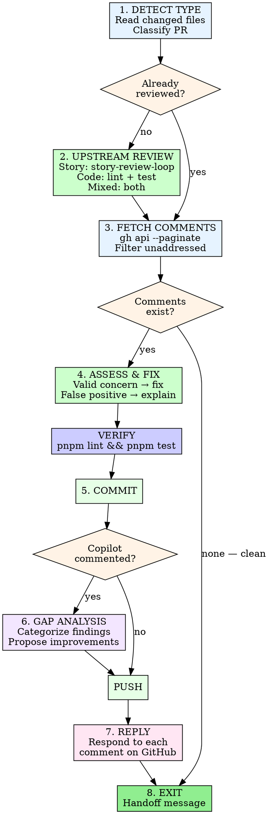

# PR Review Response (Orchestrator)

Single entry point after PR creation. Detects the PR type, runs the
appropriate upstream review pipeline, then addresses all feedback.

## Invocation

```
/pr-review-response <PR number or URL>
```

## Process



---

## Step 1: Detect PR Type

Get the list of changed files:

```bash
gh pr view <pr_number> --json files --jq '.files[].path'
```

Classify based on file paths:

| Pattern | PR Type |
|---------|---------|
| `docs/story/**` or `docs/superpowers/**` | **Story** |
| `packages/*/src/**` or `*.ts`/`*.js` (in packages/) | **Code** |
| Both Story and Code patterns present | **Mixed** |
| `.claude/**`, `.github/**`, root config (`*.json`, `*.yaml`, `*.toml`) only | **Tooling** |
| Any other `docs/**` or `*.md` (e.g., `CLAUDE.md`, `docs/analysis/`) | **Docs** |

**Priority rules:**
- If both Story and Code files are present → **Mixed**
- Tooling and Docs files are ignored when mixed with Story or Code
- A PR with only `.claude/` + `docs/analysis/` = **Docs**

**Fallback:** If no files match any pattern (empty diff or unrecognized
paths), default to **Docs** type.

---

## Step 2: Run Upstream Review (if not already run)

Before running any upstream review, check if it has already been done:

- **Story review:** Search PR comments (via `gh api --paginate`) for
  the substring `"Story Review Loop Summary"`. The actual header is
  `# Story Review Loop Summary (Multi-Agent)` — use a contains match.
  If found, skip story-review-loop.
- **Code review:** Search PR comments for a comment containing
  `"pnpm lint && pnpm test"` and `"passed"` posted by the repo owner
  or current actor. If found, skip code verification.

### Story PRs

Dispatch story-review-loop with 3 rounds:

```
/story-review-loop <PR#> 3
```

This runs the 6-agent multi-round review. Fixes are committed and
pushed. A summary comment is posted to the PR. After it completes,
continue to Step 3.

### Code PRs

Run the project's quality gates:

```bash
pnpm lint    # TypeScript type-check across all packages
pnpm test    # Run all tests (server + client)
```

If either fails, fix issues before proceeding. Post a brief comment
summarizing what was found and fixed.

### Mixed PRs

Run both pipelines sequentially:
1. **Story review first** — story-review-loop may commit fixes to
   story docs, which must pass verification afterward
2. **Code review second** — `pnpm lint && pnpm test` to verify
   everything (including story-review-loop fixes) passes

### Tooling PRs

Run `pnpm lint` only.

### Docs PRs

Run `pnpm lint` only.

---

## Step 3: Fetch Comments

**CRITICAL: Always use `--paginate`.** GitHub API defaults to 30 per
page. Without it, comments beyond page 1 are silently dropped.

```bash
gh api /repos/{owner}/{repo}/pulls/{pr_number}/reviews --paginate
gh api /repos/{owner}/{repo}/pulls/{pr_number}/comments --paginate
```

Parse each comment for: `id`, `user.login`, `path`, `line`, `body`,
`in_reply_to_id`.

**Filter to unaddressed only:** A top-level comment is "addressed" if
it already has a reply from the repo owner or current actor. Only
process comments with NO replies yet. Skip replies (non-null
`in_reply_to_id`).

**If zero unaddressed comments exist**, skip to Step 8 (exit clean).

---

## Step 4: Assess & Fix

For each unaddressed top-level comment:

| Assessment | Action |
|-----------|--------|
| **Valid concern** | Fix it |
| **False positive** | Prepare explanation for Step 7 |
| **Question/clarification** | Prepare answer for Step 7 |
| **Nitpick/style** | Fix if trivial, explain if subjective |

**Read the referenced file and lines before deciding.** Do not dismiss
concerns without understanding the code.

**Comment sources:** Comments may come from human reviewers, Claude
(`claude[bot]` / `claude`), Copilot (`copilot-pull-request-reviewer[bot]`),
or other bots. Treat all with equal rigor regardless of source.

### Fixing

- Read each file referenced by valid comments
- Implement the fix
- Group related fixes (multiple comments on same file/feature)

### Verify

Verification adapts to the detected PR type:

```bash
# Story / Code / Mixed PRs — full suite
pnpm lint && pnpm test

# Tooling / Docs PRs — lint only
pnpm lint
```

All checks must pass before committing.

---

## Step 5: Commit

Write commit message to a temp file:

```bash
cat > /tmp/commit-msg.txt << 'EOF'
type(scope): address PR review feedback

- Description of change 1
- Description of change 2

Co-Authored-By: Claude Opus 4.6 (1M context) <noreply@anthropic.com>
EOF

git add <specific-files>
git commit -F /tmp/commit-msg.txt
```

**Commit type selection:** Use the conventional commit type that matches
the PR content — `docs` for Story/Docs PRs, `fix` or `feat` for Code
PRs, `chore` for Tooling PRs. The `(scope)` should match the package
(`client`, `server`, `shared`) or use `shared` for cross-cutting docs.

**Push is deferred** until after Step 6 if Copilot commented. Otherwise
push immediately after commit.

---

## Step 6: Copilot Gap Analysis (MANDATORY when Copilot commented)

<HARD-GATE>
This step is MANDATORY whenever ANY Copilot comment exists on the PR.
Do NOT push, reply, or exit without completing the gap analysis.
Do NOT rationalize skipping it ("it's just style comments", "the
issues were trivial", "I already fixed them"). Every Copilot comment
is a data point for improving our review agents. Skipping this step
means the same issues will recur on the next PR.
</HARD-GATE>

**Checkpoint before push:** Before executing `git push`, verify:
- [ ] Copilot comments counted: {N} total
- [ ] Each categorized using `references/copilot-gap-taxonomy.md`
- [ ] Each mapped to responsible agent
- [ ] Verification checklists checked for existing coverage
- [ ] New items proposed (or explicitly "0 new items — all covered")
- [ ] User approved (or "0 new items" auto-approved)

If any comments came from `copilot-pull-request-reviewer[bot]`:

1. **Filter** Copilot comments from the full set.
2. **Categorize** each finding using the categories defined in
   `references/copilot-gap-taxonomy.md` (10 categories including
   Source verification, Classification, Numeric propagation,
   Exception tracking, Reference format, Mirror staleness,
   Self-contradiction, Post-fix regression, Formula precision,
   and Ambiguity).
3. **Map** to the appropriate review system based on PR type:
   - **Story PRs:** Map to story-review-loop agents:
     - Propagation → Agent 1 (Propagation Checker)
     - Numeric → Agent 3 (Technical) or Agent 6 (Canonical Verifier)
     - Cross-reference → Agent 6 (Canonical Verifier)
     - Ambiguity → Agent 5 (Devil's Advocate)
     - Formatting → Agent 3 (Technical, Pass K)
   - **Code PRs:** Log as "code review gap" — no agent mapping yet.
     These findings inform future code-review agent design.
   - **Mixed PRs:** Map story-file comments to agents, log code-file
     comments separately.
4. **Check** if the gap is already in
   `.claude/skills/story-review-loop/references/verification-checklists.md`
   (story gaps only).
5. **For new story gaps**, draft a one-line checklist item.
6. **Present** to the user:
   > "Copilot found N issues our review missed. M are already in
   > checklists. K are new gaps: [list]. Apply improvements?"
7. If approved, update the checklist file and commit.
8. **Push all commits** together: `git push`.

**If no Copilot comments:** Skip Step 6 and push in Step 5.

---

## Step 7: Reply to Each Comment

Reply to **every** comment individually:

```bash
gh api /repos/{owner}/{repo}/pulls/{pr_number}/comments/{comment_id}/replies \
  -f body="@username Fixed in <commit-sha>. <brief explanation>"
```

**Bot usernames:** If `user.login` ends with `[bot]`, strip the suffix.
`claude[bot]` → `@claude`.

**Copilot exception:** Do NOT `@` mention Copilot
(`copilot-pull-request-reviewer[bot]`). Mentioning it triggers follow-up
PRs. Reply without any `@` mention.

For false positives, explain why the current code is correct.

---

## Step 8: Exit with Handoff

Always end with one of these messages:

**Exit A (clean):**
> "All {N} comments addressed and pushed. PR #{number} is ready to
> merge."

**Exit B (new comments arrived):**
> "Addressed {N} comments, but {M} new comments arrived during fixes.
> Re-run `/pr-review-response {number}` to address the new round."

**Exit C (needs human decision):**
> "Addressed {N} of {total} comments. {M} require human decision:
> [list of issues needing human input]
> Resolve these, then re-run `/pr-review-response {number}`."

**Summarize** all comments and actions in a table:

| Comment | File | Action | Status |
|---------|------|--------|--------|
| "Missing null check" | api.ts:42 | Added optional chaining | Fixed |
| "This looks wrong" | utils.ts:10 | Explained why correct | Replied |

---

## Iron Rules

- **Reply to every comment.** Reviewers deserve acknowledgment.
- **Never dismiss without reading.** Open the file, read context, decide.
- **Tests must pass.** Do not push broken code to silence a reviewer.
- **One commit per review round.** Group all fixes into a single commit.
- **Temp file for commit messages.** Heredocs with special characters
  break in shell. Always write to a temp file and use `git commit -F`.
- **Explicit handoff at every exit.** Name the next action or confirm
  the PR is ready to merge.
- **NEVER skip Copilot gap analysis.** If Copilot commented, Step 6
  runs before push. No exceptions. No rationalizations. Every skipped
  analysis is a missed opportunity to improve the review agents. This
  was the #1 process failure identified on 2026-03-21.
