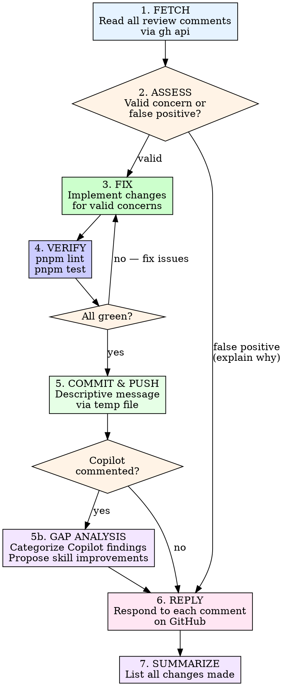

# PR Review Response

Address PR review comments end-to-end: read, assess, fix, verify, push, reply.

## Invocation

```
/pr-review-response <PR number or URL>
```

## Process



### 1. Fetch Comments

```bash
# Get owner/repo from current repo
gh api /repos/{owner}/{repo}/pulls/{pr_number}/reviews
gh api /repos/{owner}/{repo}/pulls/{pr_number}/comments
```

Parse each comment for: `id`, `user.login`, `path`, `line`, `body`, `in_reply_to_id` (skip replies — only address top-level comments).

### 2. Assess Each Comment

For each top-level comment, determine:

| Assessment | Action |
|-----------|--------|
| **Valid concern** | Fix it in Phase 3 |
| **False positive** | Prepare explanation for Phase 6 |
| **Question/clarification** | Prepare answer for Phase 6 |
| **Nitpick/style** | Fix if trivial, explain if subjective |

Read the referenced file and lines before deciding. Do not dismiss concerns without understanding the code.

**Comment sources:** Review comments may come from human reviewers, Claude (`claude[bot]` / `claude`), Copilot (`copilot-pull-request-reviewer[bot]`), or other automated reviewers. Treat all comments with equal rigor regardless of source.

### 3. Fix Valid Concerns

- Read each file referenced by valid comments
- Implement the fix
- Group related fixes (multiple comments on same file/feature)

### 4. Verify

```bash
pnpm lint
pnpm test
```

All checks must pass before proceeding. If tests fail, investigate and fix before pushing.

### 5. Commit and Push

Write commit message to a temp file to avoid shell quoting issues:

```bash
cat > /tmp/commit-msg.txt << 'EOF'
fix(scope): address PR review feedback

- Description of change 1
- Description of change 2

Co-Authored-By: Claude Opus 4.6 (1M context) <noreply@anthropic.com>
EOF

git add <specific-files>
git commit -F /tmp/commit-msg.txt
git push
```

### 5b. Copilot Gap Analysis (if Copilot commented)

If any comments came from `copilot-pull-request-reviewer[bot]`, run a
gap analysis before replying. This ensures every Copilot review round
improves our review skills.

1. **Filter** Copilot comments from the set.
2. **Categorize** each using `references/copilot-gap-taxonomy.md`.
3. **Map** to the story-review-loop agent that should have caught it.
4. **Check** if the gap is already covered by an item in
   `.claude/skills/story-review-loop/references/verification-checklists.md`.
5. **For new gaps**, draft:
   - A one-line checklist item for verification-checklists.md
   - A gap-analysis-log.md entry
6. **Present** to the user:
   > "Copilot found N issues our review missed. M are covered by
   > existing checklists. K are new gaps:
   > [list of proposed checklist additions]
   > Want me to apply these improvements?"
7. If approved, update the checklist and log files, commit and push.

The reply step (6) can then mention "added to verification checklists"
for each addressed gap, closing the feedback loop.

### 6. Reply to Each Comment

Reply to **every** comment individually using the correct API. **Mention the commenter** with `@username` so they get notified:

```bash
gh api /repos/{owner}/{repo}/pulls/{pr_number}/comments/{comment_id}/replies \
  -f body="@username Fixed in <commit-sha>. <brief explanation of what changed>"
```

**Bot usernames:** If `user.login` ends with `[bot]`, strip the suffix. For example, `claude[bot]` becomes `@claude`.

**Copilot exception:** Do NOT `@` mention Copilot (`copilot-pull-request-reviewer[bot]`) in replies. Mentioning Copilot triggers it to respond and create follow-up PRs. Reply to Copilot comments without any `@` mention — just provide the fix explanation directly.

For false positives, mention the commenter and explain why the current code is correct.

### 7. Summarize

Output a table of all comments and what was done:

| Comment | File | Action | Status |
|---------|------|--------|--------|
| "Missing null check" | api.ts:42 | Added optional chaining | Fixed |
| "This looks wrong" | utils.ts:10 | Explained why it is correct | Replied |

## Iron Rules

- **Reply to every comment.** Reviewers deserve acknowledgment, even for false positives.
- **Never dismiss without reading.** Open the file, read the context, then decide.
- **Tests must pass.** Do not push broken code to silence a reviewer.
- **One commit per review round.** Group all fixes into a single commit, not one per comment.
- **Temp file for commit messages.** Heredocs with special characters break in shell. Always write to a temp file and use `git commit -F`.
