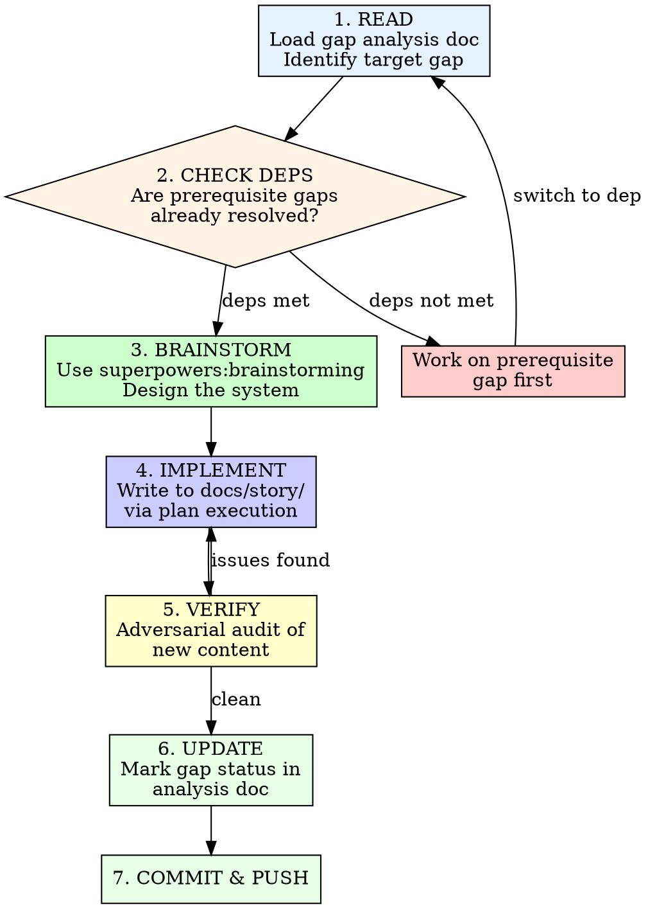

# Story Designer

Design and implement game systems for Pendulum of Despair, working from
the gap analysis document. Each invocation picks a gap, designs the
system, implements it in the story docs, and updates the gap tracker.

## Invocation

```
/story-designer                    # Show current gaps, recommend next
/story-designer <gap-id>           # Work on specific gap (e.g., "1.1")
/story-designer audit              # Re-audit all gaps against current docs
```

## Reference Document

**Gap analysis:** `docs/analysis/game-design-gaps.md`

This is the single source of truth for what's been done and what remains.
The skill reads it on every invocation and updates it after every
completed gap.

## Core Principle: Adversarial by Default

**Assume nothing is correct. Verify everything.**

When designing a new system:
- Cross-reference EVERY value against canonical story docs
- Check that numeric values are internally consistent (if ATK growth
  is 3/level and level cap is 150, max ATK = base + 447 — does that
  make sense with the damage formula?)
- Verify new content doesn't contradict existing docs
- Run the Canonical Verifier checklist (from
  `../story-review-loop/references/verification-checklists.md`) on your
  own output before committing

When auditing existing gaps:
- Don't trust the status field — read the actual docs
- Count items, verify formulas, check cross-references
- Downgrade status if the doc is less complete than claimed
- Upgrade status if work was done outside this skill

## Process



### 1. Read Gap Analysis

Load `docs/analysis/game-design-gaps.md`. Parse:
- Current status of each gap
- Dependencies between gaps
- What's needed (checklist items)

If invoked without arguments, display a summary table and recommend
the highest-priority unblocked gap.

If invoked with `audit`, re-read ALL story docs and verify every gap
status is accurate. Update any that have drifted.

### 2. Check Dependencies

Before designing a gap, verify its prerequisites are resolved:
- Read the "Depends On" field
- Check the dependency's status in the gap doc
- If the dependency is not MOSTLY COMPLETE or COMPLETE, warn the user
  and suggest working on the dependency first

Dependencies can be overridden if the user explicitly chooses to work
on a gap with unresolved deps (designing in parallel is sometimes
necessary).

### 3. Brainstorm the System

Use the `superpowers:brainstorming` skill to design the system:
- Present the gap context (what exists, what's needed, what it blocks)
- Ask SNES-era-specific design questions (reference FF4/FF6/CT)
- Propose 2-3 approaches with tradeoffs
- Get user approval on design direction
- Write the spec to `docs/superpowers/specs/`

**SNES-era design constraints to always consider:**
- Keep numbers manageable (stats 1-255, damage 1-9999)
- Formulas should be simple enough to reason about (no floating point)
- Prefer elegance over complexity (FF6's simple but deep Relic system)
- Balance should reward strategy over grinding
- Systems should be interlinked (equipment affects stats affects damage
  affects encounter difficulty affects economy)

### 4. Implement

Use `superpowers:writing-plans` to create the implementation plan, then
execute it. The output goes into `docs/story/` as the canonical game
design document.

**File naming convention for new docs:**
- `docs/story/combat-formulas.md` — damage, hit/miss, critical, ATB
- `docs/story/enemies.md` — complete bestiary
- `docs/story/items.md` — consumable and key item catalog
- `docs/story/equipment.md` — weapons, armor, accessories
- `docs/story/economy.md` — pricing, shop inventories, gold pacing
- `docs/story/ui-design.md` — menu layouts, battle screen, text boxes
- `docs/story/progression.md` — stat growth, progression crystals, level milestones

### 5. Verify (Adversarial Audit)

After implementation, run a verification pass. This is NOT optional.

**Numeric consistency checks:**
- Do damage formulas produce reasonable values at level 1, 25, 50, 150?
- Can the player kill Act I enemies in 2-4 hits? (Too fast = trivial,
  too slow = tedious)
- Do boss HP values create 3-5 minute fights? (Shorter = anticlimactic,
  longer = exhausting)
- Does gold income keep pace with equipment costs?
- Are there dead zones where nothing new is available to buy?

**Cross-reference checks:**
- Every enemy name in bestiary matches dungeons-world.md encounter tables
- Every item in shop inventories exists in the item catalog
- Every equipment piece has a price and an acquisition source
- Every spell in magic.md has damage values consistent with the formula
- Every character's stat growth produces sensible values at key milestones

**Existing doc consistency:**
- New content doesn't contradict abilities.md, magic.md, events.md
- Location-specific content matches locations.md act availability
- NPC-referenced items actually exist in the item catalog
- Quest rewards in sidequests.md match the item catalog

### 6. Update Gap Analysis

After verification passes:
1. Update the gap's status in `docs/analysis/game-design-gaps.md`
2. Check off completed items in the "What's Needed" list
3. Add a row to the Progress Tracking table
4. Check if this completion unblocks any downstream gaps
5. If downstream gaps are now unblocked, note this for the user

### 7. Commit & Push

Follow the standard commit workflow:
```bash
git add docs/story/<new-file>.md docs/analysis/game-design-gaps.md
git commit -F /tmp/commit-msg.txt
git push
```

## Audit Mode

When invoked with `/story-designer audit`:

1. Read every file in `docs/story/`
2. For each gap in the analysis doc, verify:
   - Does the referenced file exist?
   - Does the content match the claimed status?
   - Are checklist items actually completed?
   - Has anything been added outside this skill that changes a gap?
3. Update all statuses
4. Report changes:
   - Upgrades (gap was more complete than status claimed)
   - Downgrades (gap was less complete than status claimed)
   - New gaps discovered (areas not in the original analysis)
5. Commit the updated analysis doc

## Design Session Flow

A typical session looks like:

```
User: /story-designer
Claude: [Shows gap table, recommends "1.2 Stat System" as next target]

User: /story-designer 1.2
Claude: [Checks deps: none. Starts brainstorming.]
Claude: "For the stat system, FF6 used 10 stats with growth curves
         per character. Chrono Trigger used 7 with fixed growth.
         Which approach fits our 6-character party better?"
User: [Discusses, approves design]
Claude: [Writes spec, creates plan, implements in docs/story/]
Claude: [Runs adversarial verification]
Claude: [Updates gap-analysis-gaps.md: 1.2 -> COMPLETE]
Claude: "Stat system complete. This unblocks: 1.1 (Damage Formulas),
         2.2 (ATB Mechanics). (2.1 XP Curve still blocked by 1.3.)
         Recommend 1.1 next."
```

## Rules

- **One gap per session.** Deep focus on one system at a time.
- **Always brainstorm first.** Even "obvious" systems need user input.
- **Verify adversarially.** Assume your own output has errors.
- **Update the tracker.** Every session ends with an updated gap doc.
- **Cross-reference everything.** New docs must be consistent with
  existing docs. Use the Canonical Verifier checklist.
- **SNES-era constraints.** Keep numbers small, formulas simple,
  systems elegant. Reference FF4/FF6/Chrono Trigger by name.
- **Don't over-design.** YAGNI applies. Design what's needed for
  implementation, not a theoretical framework.
