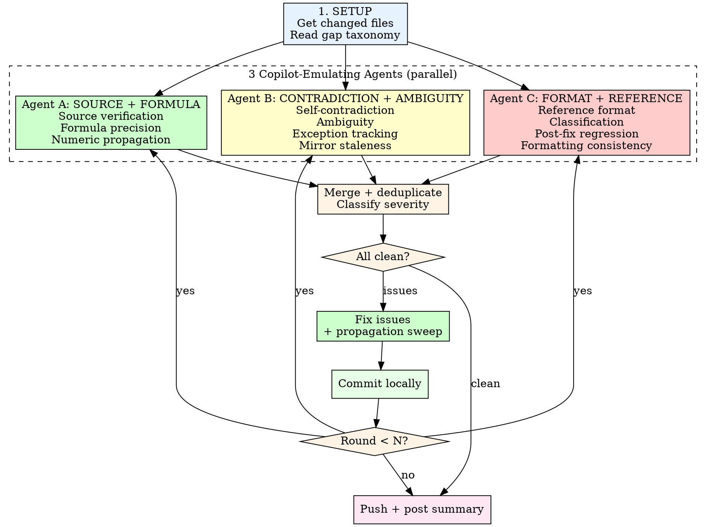

# Story Review Loop — Copilot Emulation

Drop-in replacement for `/story-review-loop` when GitHub Copilot is
unavailable. Emulates the specific issue categories Copilot catches
by dispatching 3 agents targeting the 10 gap categories from
`copilot-gap-taxonomy.md`.

## Invocation

```
/story-review-loop-cope <PR number> <N>
```

Same parameters as `/story-review-loop`. Default N=3.

## Why This Exists

Copilot finds 4-12 valid issues per PR that our 6-agent story-review-loop
misses. When Copilot is unavailable, those issues go undetected. This
skill fills the gap by dispatching agents explicitly trained on the
patterns Copilot catches, drawn from the gap taxonomy built across
PRs #17-#34.

## Process



## Agent Prompts

### Agent A: Source Verification + Formula Precision + Numeric Propagation

```
You are emulating GitHub Copilot's code review on game design
documentation. Copilot typically finds 4-12 valid issues per PR.
Your job is to find EVERY issue Copilot would catch.

Focus on these Copilot gap categories:
1. **Source verification** -- every value in the PR must match the
   canonical source doc. Read the actual source and compare
   word-for-word.
2. **Formula precision** -- verify every formula, arithmetic example,
   and numeric range. Check rounding rules, unit specifications,
   and edge cases.
3. **Numeric propagation** -- numbers that appear in multiple files
   must match exactly.

Changed files: [LIST]

SPECIFIC CHECKS:
- Read each changed story doc line by line. For EVERY numeric value
  (HP, damage, gold, percentage, duration), find the canonical
  source and verify it matches.
- Check every worked example: re-do the arithmetic. Verify
  intermediate values.
- Check every "per X.md" or "per Y.md" claim -- open that file and
  verify the section/value exists.
- Check EVERY cross-reference: if it says "see Section X" or
  "per doc.md", verify that section/doc exists and content matches.
- Check item availability qualifiers ("limited", "limited stock").
- Verify boss names, HP, levels, acts against bestiary/bosses.md.
- Verify spell effects and costs against magic.md.
- Verify item prices against items.md/equipment.md.

Be paranoid. Copilot flags things like: missing "(limited)"
qualifiers, wrong section numbers, arithmetic off by 1, formulas
that don't specify rounding, healing output ranges that don't
match the formula.

Report every issue with file:line and the specific discrepancy.

Work from: [PROJECT_ROOT]
```

### Agent B: Self-Contradiction + Ambiguity + Exception Tracking + Mirror Staleness

```
You are emulating GitHub Copilot's code review on game design
documentation. Copilot typically finds 4-12 valid issues per PR.
Your job is to find EVERY issue Copilot would catch.

Focus on these Copilot gap categories:
1. **Self-contradiction** -- does ANY rule contradict an example,
   table, or another rule in the same doc?
2. **Ambiguity** -- would an implementer have to guess? Are there
   undefined edge cases?
3. **Exception tracking** -- when a general rule is stated, do
   specific cases violate it?
4. **Mirror staleness** -- do spec/plan copies match the current
   story doc versions?

Changed files: [LIST]

SPECIFIC CHECKS:
- Read every rule and every example in each changed file. Do they
  match? Does any section contradict another?
- For every "all X are Y" claim, verify no exceptions exist.
- For every numeric range or category (e.g., "Standard boss:
  4,000-15,000 HP"), verify all entities cited actually fall
  within that range.
- Check every worked example's conclusion against the stated
  target ("within X-Y minute target" -- does that target exist?).
- Compare spec and story doc versions of the same content
  line-by-line. Flag any drift.
- Check if fixes introduced new inconsistencies.
- Look for "no rewards" / "no hidden tracking" / "no X" claims
  and verify they hold universally.

Read the verification-checklists.md at
.claude/skills/story-review-loop/references/verification-checklists.md
and check EVERY applicable item.

Report every issue with file:line and the specific discrepancy.

Work from: [PROJECT_ROOT]
```

### Agent C: Reference Format + Classification + Post-Fix Regression + Formatting

```
You are emulating GitHub Copilot's code review on game design
documentation. Copilot typically finds 4-12 valid issues per PR.
Your job is to find EVERY issue Copilot would catch.

Focus on these Copilot gap categories:
1. **Reference format** -- broken links, wrong section numbers,
   inconsistent citation style
2. **Classification** -- entity types/categories/labels that are
   wrong
3. **Post-fix regression** -- did fixes introduce new problems?
4. **Formatting consistency** -- en dash vs hyphen for ranges,
   heading uniqueness, table formatting

Changed files: [LIST]

SPECIFIC CHECKS:
- Every Markdown link: does the target file exist? Is the relative
  path correct from the file's location? (specs in
  docs/superpowers/specs/ need ../../story/ not ../story/)
- Every "Section X" reference: does that section exist?
- Numeric ranges: en dash (--) consistently, not hyphens (-) or
  double hyphens (--)
- Table formatting: consistent column counts, no broken separators
- Heading uniqueness: no duplicates in any single file
- Plain-text references that should be Markdown links
- Boss names: exact canonical match with correct articles ("The")
- Entity classifications match canonical source docs
- Gap tracker entries consistent with delivered content

Read the verification-checklists.md at
.claude/skills/story-review-loop/references/verification-checklists.md
for formatting rules.

Report every issue with file:line and the specific discrepancy.

Work from: [PROJECT_ROOT]
```

## After Each Round

1. **Merge** findings from all 3 agents. Deduplicate.
2. **Fix** all HIGH and MEDIUM issues. Skip LOW suggestions unless
   trivial.
3. **Propagation sweep** after every fix: grep all changed files
   for the entity you fixed. Verify consistency.
4. **Post-fix section re-read:** re-read the entire section around
   each edit.
5. **Verify:** `pnpm lint`
6. **Commit locally** (do NOT push until all rounds complete).

## Push and Summary

After all rounds complete (or early exit on clean round):

```bash
git push
gh pr comment <PR#> --body-file /tmp/cope-summary.md
```

Summary format matches story-review-loop format but notes
"(Copilot Emulation)" in the header.

## Rules

- **3 agents per round.** Always dispatch all 3. Each covers
  different Copilot gap categories.
- **Parallel dispatch.** Launch all 3 simultaneously.
- **Be paranoid.** Copilot finds 4-12 issues per PR. If you find
  fewer than 4 in round 1, the agents need to look harder.
- **Local commits, single push.** Same as story-review-loop.
- **Propagation sweep mandatory.** Same as story-review-loop.
- **Read verification-checklists.md.** Agents B and C must read it.

## The Expanding File Rule (CRITICAL)

<HARD-GATE>
**Never declare CLEAN without reading unexplored files.**

On PR #35, 5 COPE rounds declared CLEAN. Then a single tear-apart
pass reading previously-unexplored files (sidequests.md, npcs.md,
dungeons-world.md, bestiary/) found 7 more issues including a
CRITICAL data error (Arcanite Ingot count wrong by 7x).

The problem: agents keep re-reading the same files they already
verified. They develop confirmation bias. Copilot doesn't have this
problem because it reads the ENTIRE codebase on every review.
</HARD-GATE>

### How It Works

Each round must include at least ONE agent that reads files NO
previous round has checked. Track which canonical files have been
read across all rounds:

**Round 1 agents typically check:** abilities.md, items.md,
equipment.md, economy.md, locations.md, events.md, ui-design.md

**Round 2+ agents must EXPAND to:** sidequests.md, npcs.md,
characters.md, dungeons-world.md, dungeons-city.md, bestiary/,
magic.md, dynamic-world.md, outline.md, geography.md

**What to look for in unexplored files:**
- Dungeon chest contents that contradict item count claims
- Quest rewards that add items the doc says are scarce
- NPC dialogue that doesn't match attributed hint sources
- Boss stat tables with values that differ from bestiary/bosses.md
- Character ability descriptions that contradict mechanic rules
- Corruption/progression state changes that affect zone mechanics

### Agent Instruction Template for Expanding Rounds

Add this to ONE agent prompt per round (rotate which agent gets it):

```
EXPANDING FILE CHECK: Previous rounds have already verified
[list files checked]. This round, you MUST read these files that
NO previous agent has checked:
- [list 3-4 unexplored files relevant to the PR's topic]

For EACH unexplored file, find where it references or is
referenced by the changed files. Check for contradictions,
stale values, and missing cross-references.
```

### The "CLEAN" Verdict

Do NOT declare CLEAN unless:
1. All 3 agents report zero issues, AND
2. At least one agent in this round read files not checked by
   any previous round, AND
3. The expanding file check found zero issues

If conditions 1-2 are met but 3 is not (expanding check found
issues), fix them and run another round. CLEAN means "we checked
everywhere and found nothing," not "we checked the same files
again and found nothing new."
