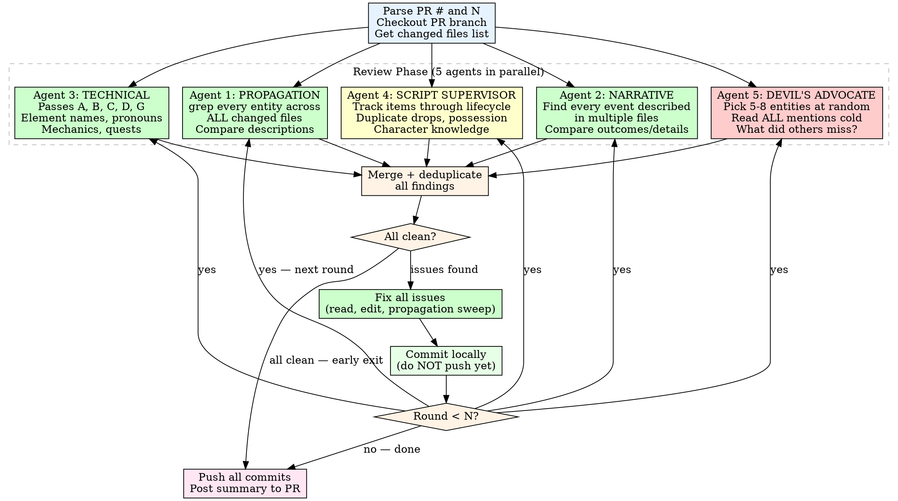

# Story Review Loop

Automate multiple rounds of story review + fix on a PR. Each round
dispatches **five specialized review agents** in parallel, fixes any
issues found, and commits locally. After N rounds (or when a round comes
back clean), push all commits at once and post a summary to the PR.

> **Dependency:** This skill delegates pass definitions to the
> `story-review` skill. It does NOT define its own passes. If
> `story-review` is updated (passes added/removed/renamed), this skill
> inherits those changes automatically. Never duplicate the pass list
> here — always reference story-review as the single source of truth.

## Why Multi-Agent?

A single monolithic review agent suffers from three systemic failure
modes that account for 73% of missed issues (measured against Copilot
review findings on PR #12):

1. **Propagation blindness (46%):** When a value is fixed in one file,
   the same value in other files isn't checked. The agent reads the
   "grep for stale references" instruction but checks 2-3 files
   instead of ALL files.
2. **Narrative coherence gaps (32%):** The agent checks names and HP
   values but doesn't compare HOW the same event is described across
   files. "Forging process" in one file vs "boring engine excavation"
   in another describes the same event differently.
3. **Context drift (22%):** By the time the agent reads file 8, it has
   forgotten the exact phrasing in file 1. Multi-author content (from
   parallel subagents during implementation) introduces inconsistencies
   that a fatigued single reviewer misses.

Splitting into focused agents means each one does LESS but does it
more THOROUGHLY. The devil's advocate agent provides fresh eyes.

## Invocation

```
/story-review-loop <PR number or URL> <N>
```

Examples:
```
/story-review-loop 9 5        # 5 rounds on PR #9
/story-review-loop https://github.com/gcko/pendulum-of-despair/pull/9 3
```

## Process



### Step 1: Setup

1. Parse the PR number from the argument (strip URL if needed).
2. Parse N (the iteration count) from the second argument. Default to 3
   if not provided.
3. Ensure you are on the correct branch for the PR:
   ```bash
   gh pr checkout <pr_number>
   ```
4. Get the list of changed story files:
   ```bash
   git diff main --name-only | grep -E 'docs/story/|docs/superpowers/'
   ```
5. Initialize tracking variables:
   - `round = 0`
   - `total_issues_fixed = 0`
   - `rounds_log = []` (collects per-round summaries)

### Step 2: Review Round (Multi-Agent)

For each round (1 through N), dispatch **five review agents in
parallel**. Each agent gets the same file list but a different mission.

#### Agent 1: Entity Propagation Checker

**Mission:** For every entity name introduced or modified in the PR,
verify its description is consistent across ALL files.

**Prompt template:**
```
You are the PROPAGATION CHECKER. Your ONLY job is finding values
that were updated in one file but not others.

Changed files: [list]

Instructions:
1. Identify every entity (boss, NPC, location, item, event) that
   was ADDED or MODIFIED in this PR.
2. For EACH entity, grep ALL changed files for that entity's name.
3. Read every match + ±10 lines of context.
4. Compare HOW the entity is described across files:
   - Same HP? Same location? Same act?
   - Same narrative description of what happened?
   - Same pronouns for characters?
   - Same item names in drops/triggers?
5. Flag ANY discrepancy — even slight wording differences that
   describe different outcomes (e.g., "city fallen" vs "wounded
   and leaderless").

Also check: spec docs and plan docs for stale values that
contradict the story docs.

Report: list of {entity, file1 description, file2 description,
discrepancy} or "No propagation issues found."
```

#### Agent 2: Narrative Coherence Checker

**Mission:** Find every EVENT described in multiple files and verify
the descriptions match.

**Prompt template:**
```
You are the NARRATIVE COHERENCE CHECKER. Your ONLY job is finding
events described differently in different files.

Changed files: [list]

Instructions:
1. Identify every STORY EVENT in the diff:
   - Boss fights (who fought, where, outcome)
   - Character appearances (who, where, when, what they did)
   - Deaths, betrayals, reunions
   - Sieges, battles, set pieces
   - NPC backstory events (what happened to them)
2. For EACH event, find ALL files that describe it.
3. Compare the descriptions:
   - Same location? (e.g., "Ashmark Factory" vs "Rail Tunnels")
   - Same mechanism? (e.g., "forging process" vs "excavation")
   - Same outcome? (e.g., "city fallen" vs "wounded")
   - Same timing/act? (e.g., Act I vs Act I-II transition)
   - Same participants?
4. Flag ANY contradiction in how the same event is described.

Pay special attention to events described in BOTH story docs and
NPC backstory — NPC entries often paraphrase events with different
details than the canonical dungeon/event description.

5. **CRITICAL: Pre-existing prose invalidated by new content.**
   For every NEW boss, encounter, trial, or feature added to an
   existing section, read the section's HEADER and OVERVIEW
   paragraph. Does the old prose still hold? Examples:
   - Location says "No encounters" but a boss was just added
   - Summary says "gains Resolve" but expanded trial defines a
     different boss and different unlock
   - Section is called "Caves" but encounter is in a clearing
   Flag any pre-existing prose that contradicts new additions.

Report: list of {event, file1 version, file2 version, contradiction}
or "No narrative coherence issues found."
```

#### Agent 3: Technical Review (Passes A-H)

**Mission:** Run the standard story-review passes from the skill.

**Prompt template:**
```
You are the TECHNICAL REVIEWER. Run the standard story-review
validation passes (A through J) as defined in the story-review
skill.

Changed files: [list]

Focus on:
- Pass A: Element names, pronouns, status effects, name collisions
- Pass B: Timeline/act consistency, flag ordering
- Pass C: Layout validity, encounter table completeness
- Pass D: Quest completeness, NPC existence
- Pass E: Cross-doc value matching (HP, flags, narrative outcomes)
- Pass F: Internal self-consistency
- Pass G: Mechanic completeness, undefined references
- Pass H: Diff-specific (renames, orphaned references)
- Pass I: Item/prop continuity (lifecycle, duplicate acquisition,
  possession logic, character knowledge tracking)
- Pass J: Semantic consistency (meaning comparison, character voice,
  role/title accuracy)

IMPORTANT: Only flag issues in content ADDED or MODIFIED by this
PR. Pre-existing issues in unchanged lines are out of scope.

Report per-pass PASS/FAIL with specific findings.
```

#### Agent 4: Script Supervisor (Item & Continuity)

**Mission:** Track every item, prop, and key item through its full
lifecycle. Inspired by Hollywood script supervision continuity reports.

**Prompt template:**
```
You are the SCRIPT SUPERVISOR. Your job is tracking items, props,
and character knowledge through their full lifecycle — like a
Hollywood continuity supervisor catching errors between takes.

Changed files: [list]

Instructions:
1. Identify every ITEM introduced in the diff (boss drops, chest
   contents, quest rewards, key items, crafting materials).
2. For EACH item, trace its lifecycle:
   - SOURCE: Where does it originate? (boss drop, treasure, NPC)
   - ACQUISITION: Is it guaranteed or RNG? Is it listed in BOTH
     a Drop line AND a Treasure list? (flag duplicates)
   - TRIGGER: If it's a key item, what does it unlock? Does the
     unlock condition match the source location?
   - CONSUMPTION: Where is it used or referenced later?
3. For every NPC with a TRIGGER condition involving a key item:
   - Verify the item exists in the stated source location
   - Verify no possession logic contradiction (NPC "carries" item
     that party must also "find" separately)
4. For every CHARACTER appearing in new content:
   - Track what they KNOW at each story point
   - Flag if they describe "witnessing" something they weren't
     present for
   - Flag if they describe "overhearing" in one file but having
     a "direct conversation" in another

Report: list of broken item chains, duplicate acquisitions,
possession contradictions, knowledge inconsistencies, or
"No continuity issues found."
```

#### Agent 5: Devil's Advocate

**Mission:** Fresh eyes. Pick entities at random and read them cold
across all files. What did the other agents miss?

**Prompt template:**
```
You are the DEVIL'S ADVOCATE. You have NO knowledge of what the
other reviewers found. Your job is to find what they missed.

Changed files: [list]

Instructions:
1. Pick 5-8 entities at RANDOM from the PR diff (bosses, NPCs,
   locations, items, events).
2. For EACH entity, read EVERY mention across ALL changed files.
   Read them as if you are a fresh implementer seeing the docs
   for the first time.
3. For each entity, ask:
   - Would I know exactly what this is from reading any ONE file?
   - Do all files agree on the details?
   - Are there logical contradictions? (e.g., an NPC "carries"
     an item that the party must also "find" elsewhere)
   - Do pronouns, locations, timings, and outcomes match?
   - Is anything described vaguely where precision is needed?
4. Also scan for:
   - In-character NPC dialogue that contradicts narrator text
   - Survival/death conditions that are inconsistent
   - Act boundaries that don't align between outline and events
   - Items that appear in drop tables under different names than
     in trigger conditions
5. **CRITICAL: Pre-existing prose invalidated by new content.**
   For each entity, read the section HEADER and OVERVIEW paragraph
   ABOVE or AROUND the new content. Does the old prose still hold
   after the addition? Examples that were missed in practice:
   - "No encounters" in a section that now has a boss below it
   - "gains Resolve" summary when the expanded trial says otherwise
   - Section called "Caves" hosting a highland clearing encounter
   This is the #1 thing other agents miss because they focus on
   the new content and don't re-read the surrounding old prose.

Be ADVERSARIAL. Assume every detail is wrong until verified.

Report: list of issues found, or "No additional issues found."
```

### Step 2b: Merge Findings

After all five agents return:

1. Collect all findings into a single list.
2. **Deduplicate:** If multiple agents found the same issue, keep the
   most specific description.
3. **Classify:** BLOCKER / ISSUE / SUGGESTION per the story-review
   skill's severity guide.
4. If zero BLOCKERs and zero ISSUEs → GO verdict.
5. If any BLOCKERs or ISSUEs → NO-GO, proceed to fix.

### Step 2c: Fix Issues

If issues are found:

1. Read each file referenced by the issues.
2. Fix every BLOCKER and ISSUE (not suggestions).
3. **Mandatory propagation sweep after EVERY fix:**
   For each entity you just fixed, grep ALL changed files (including
   spec and plan docs) for that entity's name. Read every match.
   Verify the fix is consistent everywhere. This is the #1 failure
   mode — fixing in one file but not others.
4. **Post-fix context check:** After editing a line, re-read ±10
   surrounding lines to verify the fix doesn't create a new
   contradiction with adjacent text.
5. Run `pnpm lint && pnpm test` to verify fixes.
6. If verification fails, fix the failure before proceeding.

### Step 2d: Commit Locally

```bash
git add <changed-files>
cat > /tmp/commit-msg.txt << 'EOF'
docs: address story review issues (round N)

- Description of fix 1
- Description of fix 2

Co-Authored-By: Claude Opus 4.6 (1M context) <noreply@anthropic.com>
EOF
git commit -F /tmp/commit-msg.txt
```

### Step 2e: Log and Continue

```
Round {n}: Fixed {count} issues
- Agent 1 found: [list]
- Agent 2 found: [list]
- Agent 3 found: [list]
- Agent 4 found: [list]
- After dedup: {total} unique issues
- [list of what was fixed]
```

Increment round and continue.

### Step 3: Push and Summarize

After the loop ends (either all N rounds complete or an early clean exit):

1. **Push all commits at once:**
   ```bash
   git push
   ```

2. **Post a summary comment to the PR:**
   ```bash
   gh pr comment <pr_number> --body-file /tmp/review-loop-summary.md
   ```

   The summary format:

   ```markdown
   # Story Review Loop Summary (Multi-Agent)

   **Rounds completed:** {rounds_run} of {N} requested
   **Total issues fixed:** {total_issues_fixed}
   **Final status:** CLEAN / ISSUES REMAINING

   ## Per-Round Results

   | Round | Propagation | Narrative | Technical | Script Sup. | Advocate | Unique | Fixed |
   |-------|-------------|-----------|-----------|-------------|----------|--------|-------|
   | 1 | 3 | 2 | 4 | 2 | 1 | 10 | 10 |
   | 2 | 0 | 0 | 0 | 0 | 0 | 0 | 0 |

   ## Agent Effectiveness

   | Agent | Issues Found | Unique (not found by others) |
   |-------|-------------|------------------------------|
   | Propagation | 3 | 2 |
   | Narrative | 2 | 1 |
   | Technical | 4 | 2 |
   | Script Supervisor | 2 | 1 |
   | Advocate | 1 | 1 |

   ## Commits Pushed

   - `abc1234` docs: address story review issues (round 1)

   ## Final Verdict: GO / NO-GO

   [If clean: "All agents report clean after {n} rounds."]
   [If issues remain: list remaining issues]
   ```

### Early Exit Conditions

- **Clean round:** If all five agents find zero issues, stop. No point
  continuing.
- **Same issues recurring:** If round N finds the exact same issues as
  round N-1 (fix didn't work), stop and report.
- **Verification failure:** If `pnpm lint` or `pnpm test` fails after a
  fix and cannot be resolved, stop and report.

## Rules

- **Local commits, single push.** Commit after each round but only push
  once at the end. This keeps the PR history clean.
- **Five agents per round.** Always dispatch all five. Do NOT skip the
  devil's advocate — it catches what the structured agents miss.
- **Parallel dispatch.** Launch all five agents simultaneously using a
  single message with multiple Agent tool calls.
- **No manufactured fixes.** Only fix BLOCKERs and ISSUEs. Ignore
  SUGGESTIONs unless they are trivial (one-line typo).
- **Propagation sweep is MANDATORY.** After every fix, grep all files
  for the entity you just fixed. This is non-negotiable.
- **Verify every round.** Run lint + tests after every fix commit.
- **Scope to the diff.** Only review files changed in this PR, not the
  entire story bible. But within changed files, search the WHOLE file
  for stale references.
- **Report honestly.** If issues remain after N rounds, say so. Do not
  claim clean when it is not.
- **Use temp files for commit messages and PR comments.** No heredocs
  with special characters.
- **Track agent effectiveness.** In the summary, note which agent found
  which issues. This data improves agent prompts over time.

## References

Research sources that informed the multi-agent architecture and agent
role design. Consult for deeper methodology if expanding agents.

### Multi-Agent Architecture Design
- Analysis of 51 Copilot review comments across 7 reviews on PR #12
  revealed single-agent review missed 73% of issues due to propagation
  blindness (46%), narrative coherence gaps (32%), and context drift (22%)

### Agent Role Inspirations
- **Agent 1 (Propagation):** [Lore Consistency in Game Design](https://www.meegle.com/en_us/topics/game-design/lore-consistency) — Cross-departmental narrative audit methodology
- **Agent 2 (Narrative):** [How to Write Amazing Screenplay Coverage](https://screencraft.org/blog/how-to-write-amazing-screenplay-coverage-and-feedback/) — Coverage dimensions for evaluating narrative coherence
- **Agent 3 (Technical):** See story-review/SKILL.md for pass definitions
- **Agent 4 (Script Supervisor):** [Script Supervisor Report Explained](https://sethero.com/blog/script-supervisor-report-explained/) — Continuity categories (directional, spatial, temporal, character state, prop tracking); [Ultimate Guide to Script Supervisors](https://www.studiobinder.com/blog/script-supervisor-forms-template/) — Production book and daily editor log structure
- **Agent 5 (Devil's Advocate):** [Crash meetings, keep a lore bible](https://www.gamedeveloper.com/design/crash-meetings-keep-a-lore-bible-and-other-narrative-design-tips-learned-at-king) — Cross-team review with fresh eyes as a deliberate practice
