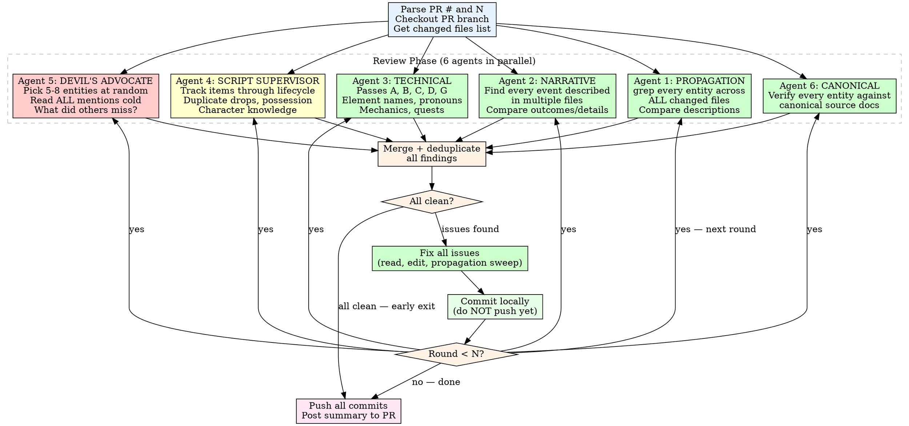

# Story Review Loop

Automate multiple rounds of story review + fix on a PR. Each round
dispatches **six specialized review agents** in parallel, fixes any
issues found, and commits locally. After N rounds (or when a round comes
back clean), push all commits at once and post a summary to the PR.

> **Dependency:** This skill delegates pass definitions to the
> `story-review` skill. It does NOT define its own passes. If
> `story-review` is updated (passes added/removed/renamed), this skill
> inherits those changes automatically. Never duplicate the pass list
> here — always reference story-review as the single source of truth.

## Why Multi-Agent?

A single monolithic review agent suffers from systemic failure modes:

1. **Propagation blindness (46%):** When a value is fixed in one file,
   the same value in other files isn't checked. Spec/plan docs that
   mirror story content go stale silently.
2. **Post-fix self-contradiction:** Fixing one line can contradict a
   claim 20+ lines away in the same section. The ±10-line context check
   is insufficient.
3. **Narrative coherence gaps (32%):** The agent checks names and HP
   values but doesn't compare HOW the same event is described across
   files.
4. **Context drift (22%):** By the time the agent reads file 8, it has
   forgotten the exact phrasing in file 1.
5. **Spec/plan hygiene gaps:** No agent checks spec metadata accuracy,
   plan shell command correctness, or whether spec file lists match
   reality.

See `references/gap-analysis-log.md` for detailed per-PR findings.

Splitting into focused agents means each one does LESS but does it
more THOROUGHLY. The devil's advocate agent provides fresh eyes.

## Invocation

```
/story-review-loop <PR number or URL> <N>
```

Examples:
```
/story-review-loop 9 5        # 5 rounds on PR #9
/story-review-loop https://github.com/gcko/pendulum-of-despair/pull/9 3
```

## Process



### Step 1: Setup

1. Parse the PR number from the argument (strip URL if needed).
2. Parse N (the iteration count) from the second argument. Default to 3
   if not provided.
3. Ensure you are on the correct branch for the PR:
   ```bash
   gh pr checkout <pr_number>
   ```
4. Get the list of changed story files:
   ```bash
   git diff main --name-only | grep -E 'docs/story/|docs/superpowers/'
   ```
5. Initialize tracking variables:
   - `round = 0`
   - `total_issues_fixed = 0`
   - `rounds_log = []` (collects per-round summaries)

### Step 2: Review Round (Multi-Agent)

For each round (1 through N), dispatch **six review agents in
parallel**. Each agent gets the same file list but a different mission.

#### Agent 1: Entity Propagation Checker

**Mission:** Verify entity descriptions are consistent across ALL files.
Check spec/plan docs for stale mirrored content.

**Prompt:** Read `agents/propagation.md` and include its full contents
as the agent's prompt in the Agent tool call.

#### Agent 2: Narrative Coherence Checker

**Mission:** Find events described differently in multiple files.
Check pre-existing prose invalidated by new content.

**Prompt:** Read `agents/narrative.md` and include its full contents
as the agent's prompt in the Agent tool call.

#### Agent 3: Technical Review (Passes A-K)

**Mission:** Run standard story-review validation passes A through K.
Includes spec/plan hygiene checks (Pass K).

**Prompt:** Read `agents/technical.md` and include its full contents
as the agent's prompt in the Agent tool call.

#### Agent 4: Script Supervisor (Item & Continuity)

**Mission:** Track items, props, and character knowledge through their
full lifecycle. Catch broken item chains and knowledge contradictions.

**Prompt:** Read `agents/script-supervisor.md` and include its full
contents as the agent's prompt in the Agent tool call.

#### Agent 5: Devil's Advocate

**Mission:** Fresh eyes. Pick entities at random, read them cold across
all files. Find what the structured agents missed.

**Prompt:** Read `agents/devils-advocate.md` and include its full
contents as the agent's prompt in the Agent tool call.

#### Agent 6: Canonical Verifier

**Mission:** Verify every entity in the PR matches its canonical source
document. Pure property verification — no narrative judgment.

**Prompt:** Read `agents/canonical-verifier.md` and include its full
contents as the agent's prompt in the Agent tool call.

### Step 2b: Merge Findings

After all six agents return:

1. Collect all findings into a single list.
2. **Deduplicate:** If multiple agents found the same issue, keep the
   most specific description.
3. **Classify:** BLOCKER / ISSUE / SUGGESTION per the story-review
   skill's severity guide.
4. If zero BLOCKERs and zero ISSUEs → GO verdict.
5. If any BLOCKERs or ISSUEs → NO-GO, proceed to fix.

### Step 2c: Fix Issues

If issues are found:

1. Read each file referenced by the issues.
2. Fix every BLOCKER and ISSUE (not suggestions).
3. **Mandatory propagation sweep after EVERY fix:**
   For each entity you just fixed, grep ALL changed files (including
   spec and plan docs) for that entity's name. Read every match.
   Verify the fix is consistent everywhere. This is the #1 failure
   mode — fixing in one file but not others.
   **Spec/plan mirror check:** When fixing a story doc section that
   has a corresponding section in the spec or plan (e.g., events.md
   section 2c is mirrored in spec Sections 4-5 and plan tables),
   read the mirrored section and verify it matches after the fix.
   Spec/plan docs that duplicate story doc content go stale silently.
   Agents 1 and 6 also reference `references/verification-checklists.md`
   for current items to verify.
4. **Post-fix section re-read (MANDATORY):** After editing ANY line,
   re-read the ENTIRE section (from the nearest `##` heading above
   to the next `##` heading or `---` separator below). Verify the
   fix is consistent with every claim, number, and rule in the
   section — not just the lines immediately adjacent. This catches
   contradictions between a fix and a simplifying principle, summary
   paragraph, or table that appears 20+ lines away in the same
   section. The ±10-line check is NOT sufficient; full-section
   re-read is required.
5. Run `pnpm lint && pnpm test` to verify fixes.
6. If verification fails, fix the failure before proceeding.

### Step 2d: Commit Locally

```bash
git add <changed-files>
cat > /tmp/commit-msg.txt << 'EOF'
docs: address story review issues (round N)

- Description of fix 1
- Description of fix 2

Co-Authored-By: Claude Opus 4.6 (1M context) <noreply@anthropic.com>
EOF
git commit -F /tmp/commit-msg.txt
```

### Step 2e: Log and Continue

```
Round {n}: Fixed {count} issues
- Agent 1 (Propagation) found: [list]
- Agent 2 (Narrative) found: [list]
- Agent 3 (Technical) found: [list]
- Agent 4 (Script Supervisor) found: [list]
- Agent 5 (Devil's Advocate) found: [list]
- Agent 6 (Canonical Verifier) found: [list]
- After dedup: {total} unique issues
- [list of what was fixed]
```

Increment round and continue.

### Step 3: Push and Summarize

After the loop ends (either all N rounds complete or an early clean exit):

1. **Push all commits at once:**
   ```bash
   git push
   ```

2. **Post a summary comment to the PR:**
   ```bash
   gh pr comment <pr_number> --body-file /tmp/review-loop-summary.md
   ```

   The summary format:

   ```markdown
   # Story Review Loop Summary (Multi-Agent)

   **Rounds completed:** {rounds_run} of {N} requested
   **Total issues fixed:** {total_issues_fixed}
   **Final status:** CLEAN / ISSUES REMAINING

   ## Per-Round Results

   | Round | Propagation | Narrative | Technical | Script Sup. | Advocate | Canonical | Unique | Fixed |
   |-------|-------------|-----------|-----------|-------------|----------|-----------|--------|-------|
   | 1 | 3 | 2 | 4 | 2 | 1 | 2 | 12 | 12 |
   | 2 | 0 | 0 | 0 | 0 | 0 | 0 | 0 | 0 |

   ## Agent Effectiveness

   | Agent | Issues Found | Unique (not found by others) |
   |-------|-------------|------------------------------|
   | Propagation | 3 | 2 |
   | Narrative | 2 | 1 |
   | Technical | 4 | 2 |
   | Script Supervisor | 2 | 1 |
   | Advocate | 1 | 1 |
   | Canonical Verifier | 2 | 1 |

   ## Commits Pushed

   - `abc1234` docs: address story review issues (round 1)

   ## Final Verdict: GO / NO-GO

   [If clean: "All agents report clean after {n} rounds."]
   [If issues remain: list remaining issues]
   ```

### Early Exit Conditions

- **Clean round:** If all six agents find zero issues, stop. No point
  continuing.
- **Same issues recurring:** If round N finds the exact same issues as
  round N-1 (fix didn't work), stop and report.
- **Verification failure:** If `pnpm lint` or `pnpm test` fails after a
  fix and cannot be resolved, stop and report.

## Rules

- **Local commits, single push.** Commit after each round but only push
  once at the end. This keeps the PR history clean.
- **Six agents per round.** Always dispatch all six. Do NOT skip the
  devil's advocate — it catches what the structured agents miss.
- **Parallel dispatch.** Launch all six agents simultaneously using a
  single message with multiple Agent tool calls.
- **No manufactured fixes.** Only fix BLOCKERs and ISSUEs. Ignore
  SUGGESTIONs unless they are trivial (one-line typo).
- **Propagation sweep is MANDATORY.** After every fix, grep all files
  for the entity you just fixed. This is non-negotiable.
- **Verify every round.** Run lint + tests after every fix commit.
- **Scope to the diff.** Only review files changed in this PR, not the
  entire story bible. But within changed files, search the WHOLE file
  for stale references.
- **Report honestly.** If issues remain after N rounds, say so. Do not
  claim clean when it is not.
- **Use temp files for commit messages and PR comments.** No heredocs
  with special characters.
- **Track agent effectiveness.** In the summary, note which agent found
  which issues. This data improves agent prompts over time.

## References

Research sources that informed the multi-agent architecture and agent
role design. Consult for deeper methodology if expanding agents.

### Multi-Agent Architecture Design

See `references/gap-analysis-log.md` for per-PR gap analysis data.

### Agent Role Inspirations
- **Agent 1 (Propagation):** [Lore Consistency in Game Design](https://www.meegle.com/en_us/topics/game-design/lore-consistency) — Cross-departmental narrative audit methodology
- **Agent 2 (Narrative):** [How to Write Amazing Screenplay Coverage](https://screencraft.org/blog/how-to-write-amazing-screenplay-coverage-and-feedback/) — Coverage dimensions for evaluating narrative coherence
- **Agent 3 (Technical):** See story-review/SKILL.md for pass definitions
- **Agent 4 (Script Supervisor):** [Script Supervisor Report Explained](https://sethero.com/blog/script-supervisor-report-explained/) — Continuity categories (directional, spatial, temporal, character state, prop tracking); [Ultimate Guide to Script Supervisors](https://www.studiobinder.com/blog/script-supervisor-forms-template/) — Production book and daily editor log structure
- **Agent 5 (Devil's Advocate):** [Crash meetings, keep a lore bible](https://www.gamedeveloper.com/design/crash-meetings-keep-a-lore-bible-and-other-narrative-design-tips-learned-at-king) — Cross-team review with fresh eyes as a deliberate practice
- **Agent 6 (Canonical Verifier):** Source-of-truth verification inspired by database foreign-key checks — every entity reference must resolve to a canonical definition
