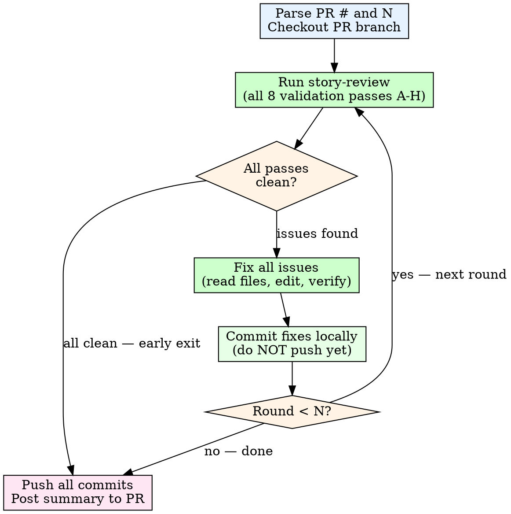

# Story Review Loop

Automate multiple rounds of story review + fix on a PR. Each round runs
the story-review validation passes, fixes any issues found, and commits
locally. After N rounds (or when a round comes back clean), push all
commits at once and post a summary to the PR.

> **Dependency:** This skill delegates ALL review logic to the
> `story-review` skill. It does NOT define its own passes. If
> `story-review` is updated (passes added/removed/renamed), this skill
> inherits those changes automatically. Never duplicate the pass list
> here — always reference story-review as the single source of truth.

## Invocation

```
/story-review-loop <PR number or URL> <N>
```

Examples:
```
/story-review-loop 9 5        # 5 rounds on PR #9
/story-review-loop https://github.com/gcko/pendulum-of-despair/pull/9 3
```

## Process



### Step 1: Setup

1. Parse the PR number from the argument (strip URL if needed).
2. Parse N (the iteration count) from the second argument. Default to 3
   if not provided.
3. Ensure you are on the correct branch for the PR:
   ```bash
   gh pr checkout <pr_number>
   ```
4. Initialize tracking variables:
   - `round = 0`
   - `total_issues_fixed = 0`
   - `rounds_log = []` (collects per-round summaries)

### Step 2: Review Round

For each round (1 through N):

1. **Run ALL validation passes from the story-review skill** against the
   current local state of the PR files. This is a LOCAL review — do NOT
   post anything to GitHub yet.

   **IMPORTANT:** The pass list is defined in story-review/SKILL.md and
   must NOT be duplicated here. Always read the current story-review
   skill to get the authoritative pass list. As of the last sync, the
   passes are A through H (8 total), but if story-review adds or
   removes passes, this loop automatically inherits the change.

   Scope the review to files changed in this PR (compare against main).

2. **If all passes are clean (GO verdict):**
   - Log: `Round {n}: CLEAN — no issues found`
   - Break out of the loop early. No need to continue.

3. **If issues are found (NO-GO verdict):**
   - Read each file referenced by the issues
   - Fix every BLOCKER and ISSUE (not suggestions)
   - **Verify added content:** When adding NEW content to fix an issue
     (new table rows, new dynamic-world sections, new entries), re-read
     the canonical source (usually dungeons-world.md) and verify every
     value in the new content (floor counts, act availability, labels)
     BEFORE committing. Do not write values from memory.
   - **Post-fix context check:** After editing a line, re-read the ±10
     surrounding lines to verify the fix does not create a new
     contradiction with adjacent text (e.g., updating a bullet but not
     the description paragraph above it that says the same thing).
   - **Post-fix zero-match verification:** After fixing stale references
     for an entity, re-run grep for that entity's name and key attributes
     across ALL changed files. Confirm ZERO stale matches remain. If any
     remain, fix them before proceeding. This catches the "updated some
     but not all" pattern that is the #1 recurring failure mode.
   - Run `pnpm lint && pnpm test` to verify fixes
   - If verification fails, fix the failure before proceeding

4. **Commit fixes locally (do NOT push):**
   ```bash
   git add <changed-files>
   cat > /tmp/commit-msg.txt << 'EOF'
   docs: address story review issues (round N)

   - Description of fix 1
   - Description of fix 2

   Co-Authored-By: Claude Opus 4.6 (1M context) <noreply@anthropic.com>
   EOF
   git commit -F /tmp/commit-msg.txt
   ```

5. **Log the round:**
   ```
   Round {n}: Fixed {count} issues
   - [list of what was fixed]
   ```

6. **Increment round and continue.**

### Step 3: Push and Summarize

After the loop ends (either all N rounds complete or an early clean exit):

1. **Push all commits at once:**
   ```bash
   git push
   ```

2. **Post a summary comment to the PR:**
   ```bash
   gh pr comment <pr_number> --body-file /tmp/review-loop-summary.md
   ```

   The summary format:

   ```markdown
   # Story Review Loop Summary

   **Rounds completed:** {rounds_run} of {N} requested
   **Total issues fixed:** {total_issues_fixed}
   **Final status:** CLEAN / ISSUES REMAINING

   ## Per-Round Results

   | Round | Result | Issues Fixed | Details |
   |-------|--------|-------------|---------|
   | 1 | Fixed | 5 | Element names, timeline, quest refs |
   | 2 | Fixed | 3 | Cross-doc refs, spell names |
   | 3 | Clean | 0 | All passes green |

   ## Commits Pushed

   - `abc1234` fix(client): address story review issues (round 1)
   - `def5678` fix(client): address story review issues (round 2)

   ## Final Verdict: GO / NO-GO

   [If clean: "All validation passes clean after {n} rounds."]
   [If issues remain: list remaining issues]
   ```

### Early Exit Conditions

- **Clean round:** If any round produces a GO verdict, stop immediately.
  No point reviewing clean code.
- **Same issues recurring:** If round N finds the exact same issues as
  round N-1 (fix didn't work), stop and report. Do not loop forever.
- **Verification failure:** If `pnpm lint` or `pnpm test` fails after a
  fix and cannot be resolved, stop and report.

## Rules

- **Local commits, single push.** Commit after each round but only push
  once at the end. This keeps the PR history clean.
- **No manufactured fixes.** Only fix BLOCKERs and ISSUEs. Ignore
  SUGGESTIONs unless they are trivial (one-line typo).
- **Verify every round.** Run lint + tests after every fix commit.
- **Scope to the diff.** Only review files changed in this PR, not the
  entire story bible.
- **Report honestly.** If issues remain after N rounds, say so. Do not
  claim clean when it is not.
- **Use temp files for commit messages and PR comments.** No heredocs
  with special characters.
