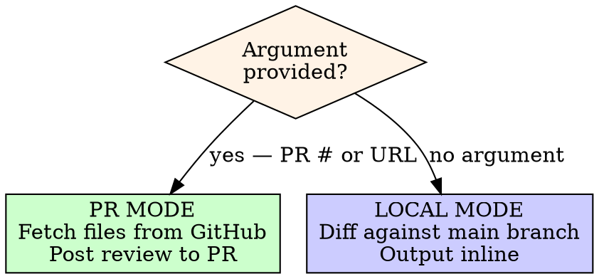

# Story & Narrative Review

Review story content for continuity, naming, layout validity, quest
completeness, cross-document consistency, internal self-consistency, and
game mechanic completeness. Posts results to GitHub when given a PR, or
outputs inline when reviewing local state.

## Invocation

```
/story-review <PR number or URL>   # Review PR, post results to GitHub
/story-review                      # Review local changes, output in Claude
```

## Mode Detection



### PR Mode (argument provided)

1. Parse the PR number from the argument (strip URL if needed)
2. Fetch changed files via `gh api /repos/{owner}/{repo}/pulls/{pr_number}/files`
3. Run all validation passes
4. Post the review as a PR comment via `gh pr review` or `gh pr comment`

**Posting the review:**

```bash
# For GO verdicts — approve the PR
gh pr review {pr_number} --approve --body-file /tmp/story-review.md

# For NO-GO verdicts — request changes
gh pr review {pr_number} --request-changes --body-file /tmp/story-review.md
```

Always write the review body to a temp file first to avoid shell quoting issues.

### Local Mode (no argument)

1. Detect changed files via `git diff main --name-only` (includes staged
   and unstaged changes against the main branch)
2. If on a feature branch with commits ahead of main, also include
   `git diff main...HEAD --name-only`
3. Run all validation passes
4. Output the review directly in the conversation — do NOT post anywhere

## Process

### 1. Fetch Changed Files

**PR Mode:**
```bash
gh api /repos/{owner}/{repo}/pulls/{pr_number}/files --jq '.[].filename'
```

**Local Mode:**
```bash
# Uncommitted changes + branch commits ahead of main
git diff main --name-only
git diff main...HEAD --name-only 2>/dev/null
```

Filter to story-relevant files:
- `docs/story/*.md`
- `packages/client/src/data/*.json` (game data)
- `.claude/skills/pod-dev/**` (skill references)
- `docs/superpowers/plans/*.md` and `docs/superpowers/specs/*.md` — if
  these files reference story entities (NPC names, boss names, pronouns,
  locations), verify those references match current story canon. Plan and
  spec docs are not authoritative but must not contradict the story docs
  they reference. Treat mismatches as ISSUEs (not BLOCKERs).

If no story-relevant files changed, report "No narrative content to review"
and stop. In PR mode, post a brief comment saying so.

### 2. Classify Changes

Read each changed file and categorize:

| Category | Files | What to check |
|----------|-------|---------------|
| **Story/Plot** | outline.md, events.md | Timeline, act structure, flag consistency |
| **Characters** | characters.md, npcs.md | Name spelling, location validity, act presence |
| **Locations** | locations.md, geography.md | Map consistency, faction alignment, route connectivity |
| **Layouts** | city-*.md, dungeons-*.md, interiors.md | ASCII map validity, building coverage, entry/exit points |
| **Visual** | biomes.md, visual-style.md, dynamic-world.md | Palette references, biome assignments, corruption stages |
| **Quests** | sidequests.md, events.md | Quest completeness, NPC/location references, accessibility |
| **Combat/Magic** | abilities.md, magic.md | Spell data, character abilities, element system, balance |
| **Systems** | building-palette.md | Template coverage, faction variants |
| **Game Data** | characters.json, enemies.json, etc. | Schema validity, ID references |

### 3. Validation Passes

Run every applicable pass based on the classified changes. Read the full
content of changed files AND the files they reference.

**CRITICAL: Adversarial reading mandate.** Do NOT read charitably. Read
every line as if you are a fresh implementer seeing it for the first
time. If a sentence COULD be misread, it WILL be misread. If a value
COULD be interpreted two ways, flag it. The goal is to find every place
where a reasonable developer would ask "wait, which one is it?"

**CRITICAL: Cell-level table auditing.** For every table in a changed
file, verify EACH CELL independently:
- Does the data in this cell belong under this column header?
- If this cell contains a level number, is this a hard requirement or
  just an expected level? Event-based unlocks should use "—" not a number.
- If this cell references a mechanic, is that mechanic fully defined?
- If this cell says "at reduced strength" or "elements combine" — are
  the exact values specified somewhere?

**CRITICAL: Undefined forward references.** Any phrase that says
something "does X" without defining X is a finding. Examples:
- "at reduced strength" (what strength exactly?)
- "elements combine" (how exactly?)
- "does not count toward the limit" (why? is this an exception to a
  stated rule? if so, document the exception in the rule itself)

**CRITICAL: Noun-existence checking.** Every noun used as a game
mechanic, action, status effect, or ability name MUST be defined
somewhere in the docs. Scan for:
- Actions characters can take ("Calibrate", "Purify", "Disrupt") —
  each must have cost, target, and effect defined
- Status effects mentioned in ability descriptions — must exist in
  magic.md's Status Effect Reference (e.g., if "burn" is mentioned but
  not defined, that's an ISSUE)
- Device/ability names referenced in story sections — must have a full
  spec in the ability tables
- Abbreviations — must match the canonical full form exactly (e.g.,
  "Non-elem" must be "Non-elemental")

**CRITICAL: Bidirectional cross-referencing.** Check BOTH directions:
- If abilities.md says character X learns spell Y, magic.md's spell Y
  definition must list character X in "Who learns"
- If magic.md's character index lists spell Y for character X, spell
  Y's definition must also list character X
- If abilities.md references a device/ability by name, the device must
  have a full definition (AC cost, duration, target, effect)
- Check the reverse: if magic.md's spell definitions list learners,
  verify each learner appears in the character spell indices too

---

#### Pass A: Name & Terminology Consistency

Cross-reference every proper noun AND game term in changed files:

**Proper nouns:**
- NPC names must match `npcs.md` exactly
- Location names must match `locations.md` exactly
- Character names must match `characters.md` exactly
- Faction names: "Valdris", "Carradan Compact" / "the Compact", "Thornmere Wilds" / "the Wilds"
- Artifact names: "the Pendulum of Despair" / "the Pendulum", "the Pallor"

**Character pronoun consistency (CRITICAL — frequently missed):**
- Each character's pronouns are as canonical as their name. Check
  `characters.md` or `npcs.md` for the canonical pronoun set (he/him,
  she/her, they/them).
- Verify ALL files in the diff use the same pronouns for the same
  character. Pronoun drift across files (e.g., they/them in npcs.md but
  he/him in outline.md) is an ISSUE.
- Common hiding spots: narrative prose in outline.md and events.md NPC
  threads, where authors may default to gendered pronouns even when the
  canonical form is they/them.

**Name collision detection (CRITICAL — missed when new entities added):**
- When new named entities are introduced (bosses, weapons, abilities,
  items, NPCs), grep `abilities.md`, `magic.md`, `npcs.md`, and
  `sidequests.md` for name collisions with EXISTING entities. A new
  entity cannot share a name with an existing one.
- Check both exact matches and near-matches that could cause confusion
  (e.g., a weapon named "Cael's Echo" colliding with a Dual Tech named
  "Cael's Echo").

**Game terminology (CRITICAL — frequently missed):**
- Element names must use canonical terms from `magic.md` everywhere:
  Flame (not fire), Frost (not ice), Storm (not lightning/thunder/wind),
  Earth, Ley, Spirit, Void, Non-elemental
- **Allowlist scanning (CRITICAL):** Scan ALL element references in
  weakness/resistance/immunity lines and damage type descriptions. Any
  element term NOT in the canonical 8 is a finding — including common
  variants: "Fire", "Ice", "Lightning", "Thunder", "Wind", "Light",
  "Dark", "Holy", "Shadow", "Nature", "Water". The scan must check
  every occurrence, not just the most obvious ones.
- Spell names must match `magic.md` exactly — no draft names, no
  abbreviations, no near-matches (e.g., "Ley Bolt" vs "Linebolt")
- Ability names must match `abilities.md` exactly
- Status effect names must match `magic.md` status reference
- "Cross-training" vs "schematic" vs "story event" vs "innate" —
  these are distinct unlock mechanisms and must not be conflated

**Vocabulary scan procedure:**
- Scan ALL text in changed files — not just headers and table cells.
  Include parenthetical text, flavor descriptions, synergy notes, and
  story integration paragraphs.
- Check for element names in ALL forms: as adjectives ("fire damage"
  should be "Flame damage"), in compound nouns ("Fire Spirit" should be
  "Flame Spirit"), and as abbreviations ("Non-elem" should be
  "Non-elemental").
- Check that every status effect name used in ability descriptions
  exists in `magic.md`'s Status Effect Reference.

Flag: misspellings, variant names not in canon, new names without
definition, non-canonical element terms, ability/spell name mismatches,
undefined status effects, abbreviation drift.

---

#### Pass B: Timeline & Act Consistency

For any changes involving act-specific content:

- NPCs must not appear after their documented death (King Aldren dies Act II)
- Locations must be accessible in the act they're referenced
- Events must trigger in correct act order per `events.md`
- **Flag ordering within act tables (frequently missed):** Within each
  act's flag table in `events.md`, verify rows are ordered by trigger
  timing (earliest first). A flag that triggers at the start of an act
  should not appear after a flag that triggers at the end. Misordered
  flags confuse downstream references and implementation.
- Pallor corruption must follow the staged progression (none in Act I, Stage 1
  in Act II borders, Stage 2 in Interlude, Stage 3 in Act III Wastes)
- Party composition must be correct per act (party scatters in Interlude,
  Sable is solo, reassembles by Act III)

Flag: anachronisms, dead characters speaking, inaccessible locations, wrong
party state.

---

#### Pass C: Layout Validity

For ASCII map changes:

- Maps must be rectangular (consistent line lengths)
- Legend must define every symbol used in the map
- Entry/exit points must exist and connect to documented routes
- Every labeled building must appear in the building directory
- Save points must exist in every settlement and before every boss
- Buildings referenced in NPC locations must appear on the map

**ASCII diagrams (non-map):**
- Relationship charts, interconnection maps, and other ASCII diagrams
  should use consistent connector formatting. Verify all relationship
  lines have matching start/end connectors (arrows, dashes).
- If a diagram uses a convention (e.g., `----` for connections, `+--`
  for branches), verify it is applied consistently throughout.

**Encounter table vs boss completeness (CRITICAL — frequently missed):**
- Every boss defined in a dungeon section (via a `**Boss:` stat block)
  must have a corresponding row in that dungeon's encounter table.
- Cross-check boss stat block headers against encounter table rows.
  Missing encounter table entries for defined bosses are an ISSUE.

Flag: undefined symbols, missing legend entries, orphaned buildings,
missing save points, entry/exit gaps, inconsistent diagram formatting,
boss stat blocks without encounter table rows.

---

#### Pass D: Quest Completeness

For side quest or event changes:

- Every quest giver NPC must exist in `npcs.md`
- Every quest location must exist in `locations.md` or city layout docs
- Quest availability must reference a valid act/event flag
- Quest rewards must be items that exist in the game data or are defined
- Quest chains must have no dangling "next step" without resolution
- Quest-locked areas in `dungeons-city.md` must reference real quests

**Downstream gating check (CRITICAL — missed when dungeons expand):**
When a dungeon's floor structure or act-gating changes, check ALL
quests in `sidequests.md` that reference that dungeon. If a quest
requires an item/tablet/event from a specific floor, verify that floor
is accessible during the quest's availability window. Example: if a
quest is available in the Interlude but its required item is on Floor 5
which is Act III-gated, the quest is broken. Either move the item to an
accessible floor or update the quest to span multiple acts.

Flag: nonexistent NPCs/locations, impossible availability windows,
undefined rewards, hanging quest threads, quest items behind act gates
that conflict with quest availability.

---

#### Pass E: Cross-Document Value Matching

When a change references content in another document, verify not just
that the reference EXISTS but that the VALUES MATCH exactly.

**Existence checks:**
- Referenced content actually exists in the target document
- References are bidirectional where expected

**New detail propagation (CRITICAL — missed when multiple files updated):**
When a location state description (`dynamic-world.md`) or event thread
(`events.md`) introduces NEW backstory or lore for a named NPC, verify
that detail is reflected in the NPC's canonical entry in `npcs.md`. New
lore must propagate bidirectionally — if `dynamic-world.md` says an NPC
was "haunted by a visit from a scholar," the NPC's `npcs.md` entry must
also reference that visit. The same applies in reverse: if `npcs.md`
adds a detail, files that describe the same NPC's location state should
be consistent.

**Item/consumable cross-references (frequently missed):**
When an item's status-effect cure is changed (e.g., "Cure Freeze" →
"Cure Slow"), verify the TARGET status in `magic.md`:
- Does the status effect's cure list include this item?
- Is the cure thematically appropriate? (A tea shouldn't cure Petrify
  if Petrify requires Purge/Soft Stone per magic.md)
- Apply the same bidirectional check to items that grant status
  resistance, immunity, or infliction

**Value-level checks (CRITICAL — this is where most issues hide):**
- Spell learn levels must be IDENTICAL between `abilities.md` and
  `magic.md` (e.g., if abilities.md says Cael learns Linebolt at Lv 6,
  magic.md must say the same — not Lv 1)
- MP costs must match between any summary table and the canonical
  spell definition in `magic.md`
- Character spell counts in summaries must match the actual spell index
- Description claims ("10-12 spells", "level-up only") must match the
  actual data in spell indices
- Cross-training tables in `abilities.md` must match the cross-trained
  entries in `magic.md` character spell indices
- If a spell/ability is described as learned via "schematic" in one
  place, it must not be described as "cross-trained" elsewhere
- Unlock method (level-up / story event / schematic / cross-training /
  innate) must be consistent across ALL references to the same spell
- If a spell/ability is event-based (story trigger), it must NOT show
  a concrete level number in a "Level" column — use "—" instead. A
  level number implies level-gating, which contradicts event-based
  unlocking. This is the #1 most common cross-doc value mismatch.

**Specific high-risk cross-references:**
- `abilities.md` Ley Line spell list "Learned By" ↔ `magic.md` character indices
- `abilities.md` cross-training table ↔ `magic.md` character indices
- `abilities.md` progression tables ↔ `magic.md` character indices
- Description prose (spell counts, learn methods) ↔ actual data tables

**Summary/reference table propagation (CRITICAL — frequently missed):**
When any entity's data changes (floor count, act availability, dungeon
type, variant count), the change must propagate to EVERY summary table
that references that entity. These tables compile data from across the
document and are the #1 source of stale values. For each changed entity,
verify its row in ALL of the following:
- `dynamic-world.md` Map Variant Count table (variant count, labels,
  notes column). Also re-verify the Summary section totals (locations
  needing N variants) — recount from the table, do not trust the old
  totals.
- `biomes.md` dungeon/location appendix table (biome, sub-biome, act
  availability column). ALSO check "Locations Using This Biome" prose
  lists — these describe entity scale/room counts in narrative form
  and are frequently stale. ALSO check the Healing/restoration summary.
- `locations.md` Location Progression tables (table section placement,
  type column, purpose column). Check that the entity is in the CORRECT
  section (Act I / Act II / Interlude / Act III / Post-Game) based on
  its first-available act.
- `events.md` location state tables (per-act state descriptions)

**Classification label consistency (CRITICAL — frequently missed):**
Table cells often contain categorical labels that assert properties
about a location, dungeon, or mechanic. These labels must match the
canonical description. Common mismatches:
- "mini-dungeon" vs "dungeon" — if a dungeon was expanded, every table
  cell and prose reference must update
- "critical path" vs "optional" — must match the progression table and
  locations.md description
- "Post-Game" section placement for content available earlier — if a
  dungeon is accessible in the Interlude, it should not be in the
  Post-Game section of a progression table
- Variant counts — if a dungeon now spans multiple acts with different
  states, it likely needs more than 1 variant

**Prerequisite location accessibility (frequently missed):**
When a dungeon is added to an act's events.md table, verify that the
PARENT LOCATION containing the dungeon is also listed as accessible in
that act. If a dungeon is inside Caldera but Caldera the city isn't
listed as opening in Act II, there is a logical gap — the player can't
reach the dungeon entrance. Check:
- For each dungeon entry in events.md, identify the containing city
  or region (from locations.md or dungeons-world.md)
- Verify the containing location has its own entry in the same act's
  location state table (or is already established as accessible from a
  prior act)

Flag: value mismatches, conflicting unlock methods, incorrect counts,
stale descriptions that don't match current data, stale classification
labels, summary table rows not updated, incorrect table section
placement, missing prerequisite location entries.

---

#### Pass F: Internal Self-Consistency

Check each changed file AGAINST ITSELF for contradictions. This is the
most commonly missed category.

**Within a single document, check:**
- If a term is defined in one section, every other section must use it
  the same way (e.g., if AP gain is defined as "per hit" at the top,
  sub-abilities must not say "per 10% HP absorbed")
- If a rule is stated (e.g., "cross-training grants spells only"), no
  example should violate it (e.g., listing a device variant as cross-trained)
- Summary/overview sections must match the detailed data that follows
  (e.g., "10-12 spells" in the overview but 14 in the index)
- Tables must be internally ordered correctly (levels ascending, tiers
  consistent)
- Column placement must match column headers (e.g., a device variant
  should not appear in a "Magic (Cross-Train)" column)
- If a marker convention is defined (e.g., "[S] for story-triggered"),
  it must be applied consistently to ALL qualifying entries
- Balance guidelines must match actual spell/ability values (e.g., if
  guidelines say "Tier 2 buffs last 6-8 turns" but spells show 5 turns)
- Status effect rules must not contradict each other (e.g., "Purge
  cures all statuses including Stop" vs "Stop cannot be cured")

**Entity-wide stale reference sweep (CRITICAL — #1 missed category):**
When an entity undergoes a major reclassification in the diff (e.g.,
"mini-dungeon" → "7-floor dungeon", "3 floors" → "5 floors", location
changes acts, sealed door now opens), search the ENTIRE changed file —
not just the diff hunks — for stale references to that entity.

**Search procedure (mandatory — do not skip steps):**
1. Search for the entity NAME (e.g., "Dry Well", "Ley Line Depths",
   "Ember Vein") across ALL changed files using grep. Read every match
   location plus ±10 lines of context. Do not skip matches even if
   there are many — read EVERY one.
2. Search for the entity's KEY ATTRIBUTES — distinctive features that
   other sections may describe without using the entity name. Examples:
   - "sealed door" (key attribute of Ley Line Depths)
   - "cannot be opened" (old behavior of the sealed door)
   - "mini-dungeon" (old classification of Dry Well)
   - Floor counts ("three rooms", "four rooms", "3 floors")
   Run grep for each key attribute across ALL changed files.
3. In each match, check whether the text reflects the NEW state or the
   OLD state. If old, it is a stale reference — flag it.

**Assessment rigor (CRITICAL — #1 reason stale refs slip through):**
The search finds matches. The failure is in ASSESSMENT. When reading a
match, do NOT give it the benefit of the doubt. Apply this test:
- Would a fresh reader, seeing ONLY this paragraph, get the correct
  current state of the entity? If the paragraph says "inaccessible" or
  "unknown" or "no one has reached" for something that IS now accessible
  and known, it is stale — even if the paragraph is in a section about
  an earlier act. Sections about earlier acts should say "in Act II,
  this cannot be opened" not just "this cannot be opened" unqualified.
- Words that signal staleness: "unknown", "inaccessible", "mystery",
  "no one has reached", "fate is unknown", "seeds future content",
  "unanswered", "collapsed" (when deep floors survived). These are
  red flags when applied to entities whose state changed in this PR.

**Common hiding spots (these are missed most often):**
- Description paragraphs ABOVE the key features bullets (the prose
  paragraph often says the same thing as the bullets but in narrative
  form — updates to bullets do not automatically update the paragraph)
- "Locations Using This Biome" lists in biomes.md (prose descriptions
  of scale, room counts, key features per location)
- Healing/restoration section summaries in biomes.md
- Act-by-act change sections in dynamic-world.md
- NPC dialogue that references the entity's old description
- Appendix/summary tables at the end of the file

The rule "check changed files, not the universe" applies to WHICH FILES
you review (only changed files). Within a changed file, you must search
the WHOLE file for stale references to reclassified entities.

**Verify content you ADD, not just pre-existing content (CRITICAL):**
When the review process itself adds new content (table rows, new
sections in dynamic-world.md, new entries in events.md), that added
content must be cross-checked against the canonical source BEFORE
committing. Common errors in added content:
- Wrong floor counts (writing "3 floors" when the dungeon has 4)
- Wrong act labels ("Only Visit" when the dungeon is revisitable)
- Wrong classification labels ("critical path" for optional content)
- Values copied from memory rather than verified against the source
For every new section or row you add, re-read the canonical source
(usually dungeons-world.md or locations.md) and verify every value.

**Specific patterns to scan for:**
- Section headers/labels that don't match their contents (e.g., a
  section called "Spell List" that only shows 8 of 30+ spells)
- "Including X" lists that include items excluded elsewhere
- Defined categories that leak into each other
- Descriptions using adjectives from the wrong tier (e.g., "Heavy"
  for a Tier 2 spell when "Heavy" means Tier 3)
- Table column headers that don't match cell contents (e.g., a column
  called "Cross-Train" containing schematic entries, or a "Forgewright
  Ability" column containing spells)
- Global rules contradicted by specific exceptions that aren't documented
  at the rule level (e.g., "max 2 devices" but a combo says "doesn't
  count toward the limit" — the rule must acknowledge the exception)

Flag: self-contradictions, stale summaries, misplaced data, broken
marker conventions, guideline-vs-data mismatches.

---

#### Pass G: Mechanic Completeness & Edge Cases

For any game mechanic definitions (abilities, spells, combat rules):

**Ambiguity checks:**
- Every mechanic must have ONE clear interpretation. If a reasonable
  implementer could read it two ways, it needs clarification.
- Resource generation rules must be unambiguous (e.g., "ally casts a
  spell" — does the caster count as their own ally?)
- Targeting rules must account for all cases (e.g., "removes enemy
  buffs" — can players also remove their own buffs?)

**Edge case checks:**
- What happens when a mechanic interacts with enemies that don't use
  the same resource? (e.g., Siphon vs enemies with no MP)
- What happens at boundary conditions? (0 AP, max AP, 0 MP, KO'd
  party member targeted by a buff)
- Are there naming collisions between different systems? (e.g., an
  ability name too similar to a spell name)

**Narrative logic contradictions (CRITICAL — frequently missed):**
- For any NPC with a trigger condition involving a key item, verify
  item ownership/location is logically consistent. If an NPC "carries"
  an item, the party cannot also possess that same item as a trigger.
  If an item drops from Boss X, the NPC entry must not say the item is
  found elsewhere.
- For any mechanic that involves showing, giving, or using an item,
  verify the item's source is documented and reachable at the time the
  mechanic is available.

**Undefined forward reference checks (CRITICAL — most missed category):**
Scan every effect description for phrases that reference undefined
behavior. Common patterns:
- "at reduced strength" — what exact numbers?
- "elements combine" — what combination rule?
- "does not count toward the limit" — is this exception documented
  in the rule itself?
- "a weaker version" — what exactly is weaker? Numbers required.
- "scales with" — what formula?
- "chance to" — what percentage?
If any effect description uses vague language where an implementer
would need to make a judgment call, flag it as an ISSUE.

**Completeness checks:**
- Every ability that claims to interact with another system must have
  that interaction documented in BOTH places
- Every spell tier must have consistent language across all instances
- Cost fields must be unambiguous (MP Cost: 1 but "costs HP instead"
  is confusing — should be MP Cost: 0 with separate HP Cost field)

Flag: ambiguous mechanics, undocumented edge cases, naming collisions,
one-sided interaction documentation, misleading cost/stat fields.

---

#### Pass H: Diff-Specific Checks

For modifications (not just additions):

- If an NPC was renamed, verify ALL documents were updated (not just one)
- If a location was removed, verify no other document still references it
- If an event flag was renamed, verify `events.md` and `dynamic-world.md` match
- If a quest was modified, verify the quest giver's dialogue hints still match
- If a spell was renamed/rebalanced, verify ALL references across both
  `abilities.md` and `magic.md` were updated

Flag: partial renames, orphaned references to removed content.

---

### 4. Verdict

Categorize every finding:

| Severity | Meaning | Blocks? |
|----------|---------|---------|
| **BLOCKER** | Breaks continuity, creates plot holes, makes quests impossible, or makes a mechanic unimplementable | Yes |
| **ISSUE** | Inconsistency that will confuse players or developers, including value mismatches and self-contradictions | Yes |
| **SUGGESTION** | Improvement opportunity, not a defect | No |

#### GO Verdict

If zero BLOCKERs and zero ISSUEs:

```
## Verdict: GO

All validation passes clean. No continuity issues found.
```

Do NOT add suggestions if there are none. An empty suggestions section is
better than manufactured feedback.

#### NO-GO Verdict

If any BLOCKERs or ISSUEs exist:

```
## Verdict: NO-GO

### Blockers
1. [description, file, line if applicable]

### Issues
1. [description, file, line if applicable]

### Suggestions (only if any exist)
1. [description]
```

## Output Format

The review body (used for both PR comments and inline output):

```markdown
# Story Review: PR #<number>  (or "Story Review: Local Changes")

**Files reviewed:** <count>
**Categories:** <list of applicable categories>

## Validation Results

### Pass A: Name & Terminology Consistency -- PASS / FAIL
[findings if any]

### Pass B: Timeline & Act Consistency -- PASS / FAIL
[findings if any]

[...only passes that were applicable...]

## Verdict: GO / NO-GO

[blockers and issues if NO-GO]
[suggestions only if they exist]
```

## Rules

- **Read before judging.** Open every referenced file. Do not flag
  something as missing without checking the canonical source.
- **No manufactured suggestions.** If everything is correct, say so and
  stop. Do not invent "nice to have" items to appear thorough.
- **Severity matters.** A typo in an NPC name is an ISSUE. A quest
  referencing a deleted location is a BLOCKER. Do not inflate severity.
- **Check changed files, not the universe.** Only review files that were
  CHANGED or ADDED — do not audit the entire story bible. But WITHIN a
  changed file, search the WHOLE file for stale references to entities
  whose classification changed in the diff (e.g., if a dungeon went
  from "mini-dungeon" to "7 floors", grep the entire file for the old
  label). The diff tells you WHICH files; the entity tells you WHAT to
  search for within those files.
- **Cross-reference is mandatory.** Every proper noun in a changed file
  must be verified against the canonical source. No assumptions.
- **Values, not just existence.** When cross-referencing, check that
  numbers, levels, costs, and descriptions MATCH — not just that the
  referenced item exists somewhere. Value mismatches are the #1 source
  of issues that slip through basic existence checks.
- **Read each file against itself.** The most common issues are internal
  contradictions within a single document — a definition in one section
  contradicted by usage in another section of the same file.
- **Temp files for GitHub posts.** Always write review body to a temp file
  before posting via `gh`. Never use heredocs with special characters.
