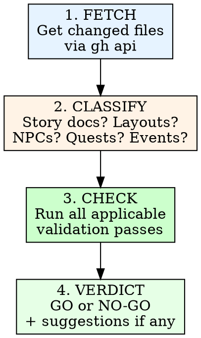

# Story & Narrative PR Review

Review PRs containing storyboard, game logic, ASCII layout, or narrative
connection changes. Produces a continuity verdict with suggestions only when
issues exist.

## Invocation

```
/story-review <PR number or URL>
```

## Process



### 1. Fetch Changed Files

```bash
gh api /repos/{owner}/{repo}/pulls/{pr_number}/files --jq '.[].filename'
```

Filter to story-relevant files:
- `docs/story/*.md`
- `packages/client/src/data/*.json` (game data)
- `.claude/skills/pod-dev/**` (skill references)

If no story-relevant files changed, report "No narrative content in this PR"
and stop.

### 2. Classify Changes

Read each changed file and categorize:

| Category | Files | What to check |
|----------|-------|---------------|
| **Story/Plot** | outline.md, events.md | Timeline, act structure, flag consistency |
| **Characters** | characters.md, npcs.md | Name spelling, location validity, act presence |
| **Locations** | locations.md, geography.md | Map consistency, faction alignment, route connectivity |
| **Layouts** | city-*.md, dungeons-*.md, interiors.md | ASCII map validity, building coverage, entry/exit points |
| **Visual** | biomes.md, visual-style.md, dynamic-world.md | Palette references, biome assignments, corruption stages |
| **Quests** | sidequests.md, events.md | Quest completeness, NPC/location references, accessibility |
| **Systems** | building-palette.md | Template coverage, faction variants |
| **Game Data** | characters.json, enemies.json, etc. | Schema validity, ID references |

### 3. Validation Passes

Run every applicable pass based on the classified changes. Read the full
content of changed files AND the files they reference.

#### Pass A: Name Consistency

Cross-reference every proper noun in changed files against the canonical
source documents:

- NPC names must match `npcs.md` exactly
- Location names must match `locations.md` exactly
- Character names must match `characters.md` exactly
- Faction names: "Valdris", "Carradan Compact" / "the Compact", "Thornmere Wilds" / "the Wilds"
- Artifact names: "the Pendulum of Despair" / "the Pendulum", "the Pallor"

Flag: misspellings, variant names not in canon, new names without definition.

#### Pass B: Timeline & Act Consistency

For any changes involving act-specific content:

- NPCs must not appear after their documented death (King Aldren dies Act II)
- Locations must be accessible in the act they're referenced
- Events must trigger in correct act order per `events.md`
- Pallor corruption must follow the staged progression (none in Act I, Stage 1
  in Act II borders, Stage 2 in Interlude, Stage 3 in Act III Wastes)
- Party composition must be correct per act (party scatters in Interlude,
  Sable is solo, reassembles by Act III)

Flag: anachronisms, dead characters speaking, inaccessible locations, wrong
party state.

#### Pass C: Layout Validity

For ASCII map changes:

- Maps must be rectangular (consistent line lengths)
- Legend must define every symbol used in the map
- Entry/exit points must exist and connect to documented routes
- Every labeled building must appear in the building directory
- Save points must exist in every settlement and before every boss
- Buildings referenced in NPC locations must appear on the map

Flag: undefined symbols, missing legend entries, orphaned buildings,
missing save points, entry/exit gaps.

#### Pass D: Quest Completeness

For side quest or event changes:

- Every quest giver NPC must exist in `npcs.md`
- Every quest location must exist in `locations.md` or city layout docs
- Quest availability must reference a valid act/event flag
- Quest rewards must be items that exist in the game data or are defined
- Quest chains must have no dangling "next step" without resolution
- Quest-locked areas in `dungeons-city.md` must reference real quests

Flag: nonexistent NPCs/locations, impossible availability windows,
undefined rewards, hanging quest threads.

#### Pass E: Cross-Document References

When a change references content in another document:

- Verify the referenced content actually exists
- Verify the reference is bidirectional where expected (if `events.md` says
  an NPC moves to a location, that location's doc should acknowledge them)
- Check that shop inventories in city docs don't reference items absent from
  the game data
- Check that dungeon encounter tables reference enemies that exist

Flag: broken references, one-way references that should be mutual, phantom
items/enemies.

#### Pass F: Diff-Specific Checks

For modifications (not just additions):

- If an NPC was renamed, verify ALL documents were updated (not just one)
- If a location was removed, verify no other document still references it
- If an event flag was renamed, verify `events.md` and `dynamic-world.md` match
- If a quest was modified, verify the quest giver's dialogue hints still match

Flag: partial renames, orphaned references to removed content.

### 4. Verdict

Categorize every finding:

| Severity | Meaning | Blocks PR? |
|----------|---------|------------|
| **BLOCKER** | Breaks continuity, creates plot holes, makes quests impossible | Yes |
| **ISSUE** | Inconsistency that will confuse players or developers | Yes |
| **SUGGESTION** | Improvement opportunity, not a defect | No |

#### GO Verdict

If zero BLOCKERs and zero ISSUEs:

```
## Verdict: GO

All validation passes clean. No continuity issues found.
```

Do NOT add suggestions if there are none. An empty suggestions section is
better than manufactured feedback.

#### NO-GO Verdict

If any BLOCKERs or ISSUEs exist:

```
## Verdict: NO-GO

### Blockers
1. [description, file, line if applicable]

### Issues
1. [description, file, line if applicable]

### Suggestions (only if any exist)
1. [description]
```

## Output Format

```markdown
# Story Review: PR #<number>

**Files reviewed:** <count>
**Categories:** <list of applicable categories>

## Validation Results

### Pass A: Name Consistency -- PASS / FAIL
[findings if any]

### Pass B: Timeline & Act Consistency -- PASS / FAIL
[findings if any]

[...only passes that were applicable...]

## Verdict: GO / NO-GO

[blockers and issues if NO-GO]
[suggestions only if they exist]
```

## Rules

- **Read before judging.** Open every referenced file. Do not flag
  something as missing without checking the canonical source.
- **No manufactured suggestions.** If everything is correct, say so and
  stop. Do not invent "nice to have" items to appear thorough.
- **Severity matters.** A typo in an NPC name is an ISSUE. A quest
  referencing a deleted location is a BLOCKER. Do not inflate severity.
- **Check the diff, not the universe.** Only validate content that was
  CHANGED or ADDED in this PR. Do not audit the entire story bible on
  every review.
- **Cross-reference is mandatory.** Every proper noun in a changed file
  must be verified against the canonical source. No assumptions.
